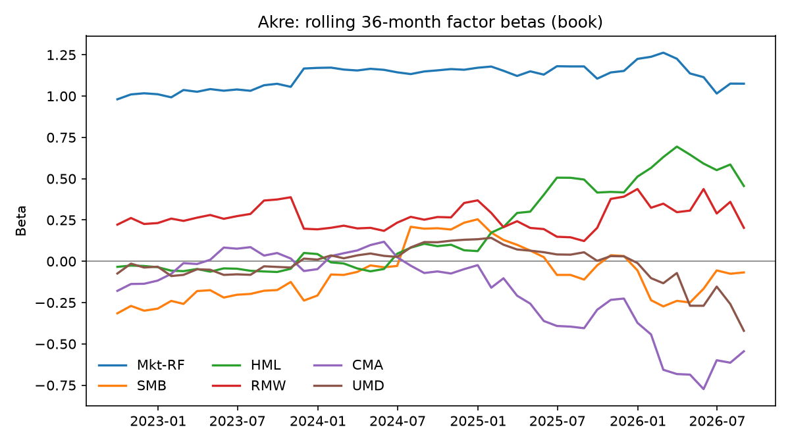
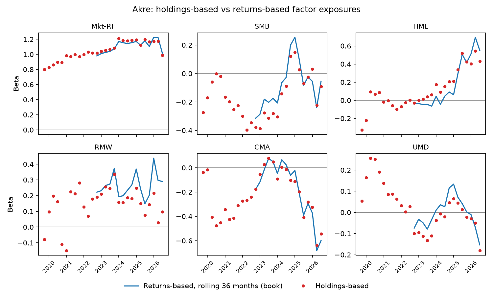
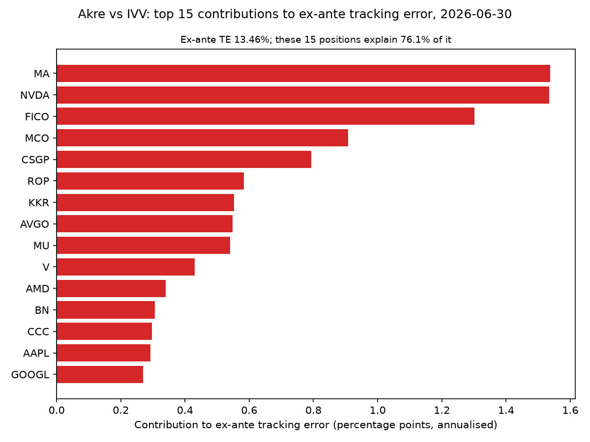
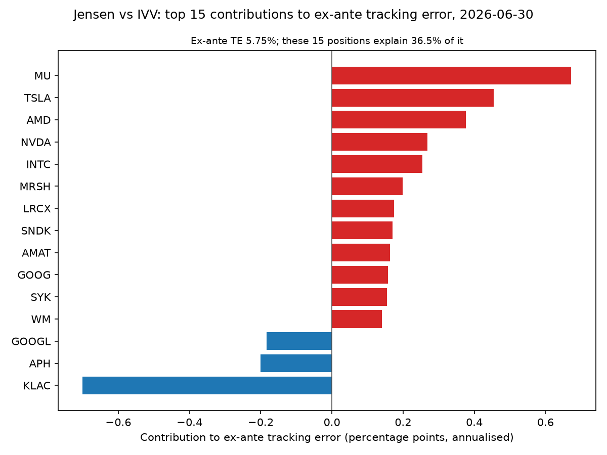
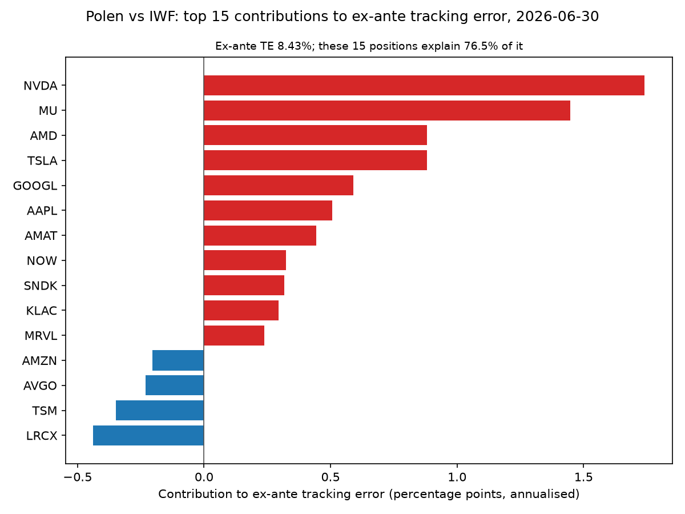

# Performance and risk attribution on real 13F holdings

## What this is

This repo takes the quarterly 13F holdings of 3 concentrated quality-growth managers (Akre, Jensen and Polen) and the N-PORT holdings of their ETF benchmarks (IVV for Akre and Jensen, IWF for Polen), and works out where each manager's return against its benchmark came from. Each quarter's book is split into the Fama-French 12 industries (FF12) and attributed with Brinson-Fachler, and the 28 quarters are linked with Carino. Monthly book returns go through a Fama-French 5-factor plus momentum regression with HAC standard errors, and active risk comes from a Ledoit-Wolf covariance of daily returns.

Everything is built from free public data: SEC EDGAR filings, the OpenFIGI mapping API, yfinance prices and Ken French's data library. Each 13F book is checked against the fund's own NAV before it is attributed, and each manager gets a 4-page PDF report in `outputs/reports/`. The method is written out in full in [docs/METHODS.md](docs/METHODS.md).

## Answers

**Allocation, selection and interaction.** Every fund trailed its benchmark over the 28 quarters to September 2026. Akre's book returned 7.2% a year against 16.3% for IVV, a cumulative excess return D of −124.9 pp. Jensen's returned 10.7% against the same 16.3% (D of −84.2 pp), and Polen's 9.8% against 18.8% for IWF (D of −141.5 pp). Selection, not allocation, carried most of it for Akre and Polen. Linked with Carino, Akre's selection is −130.4 pp against allocation of −55.1 pp, and Polen's is −135.6 pp against −23.2 pp. Jensen's loss is also selection, −68.0 pp, with allocation of 2.4 pp. The mean quarterly selection effect is −2.25% for Akre and −1.88% for Polen, and both bootstrap intervals are entirely negative (−3.74% to −0.95%, and −2.74% to −0.97%). Jensen's mean quarterly selection of −1.10% has an interval of −2.32% to 0.11%, which reaches into positive values, so this sample cannot distinguish Jensen's selection from no effect. Only Akre's allocation interval is entirely negative (−1.63% to −0.15%).

**Factors.** Jensen's alpha is −0.32% a month on the book, with a HAC t of −2.23, and −0.36% on the NAV, with a t of −2.42. Polen's is −0.40% on the book (t of −2.06) and −0.52% on the NAV (t of −2.59). Akre's alpha of −0.46% a month on the book (t of −1.39, interval −0.99% to 0.08%) cannot be told apart from no alpha. Its R² of 0.76, against 0.92 for Jensen and 0.93 for Polen, says most of Akre's active risk is stock-specific: its residual volatility is 10.0% a year. Market betas on the book are 0.96 for Akre, 0.88 for Jensen and 1.04 for Polen. Akre's exposures drifted the most: from 2025 its value loading climbed and its investment loading fell away (Akre's rolling beta chart below).

**Active risk.** At 2026-06-30 Akre's active share against IVV was 97.4% and its ex-ante tracking error 13.5%. Jensen's were 61.6% and 5.8%, and Polen's against IWF 61.8% and 8.4%. A few positions carry most of that risk for Akre and Polen: the top positions in each tracking error chart below explain 76.1% of Akre's ex-ante tracking error and 76.5% of Polen's, against 36.5% of Jensen's. Akre's largest single contribution is a position it holds, MA at 1.5 pp. Polen's and Jensen's are names they do not own: NVDA at 1.7 pp and MU at 0.7 pp. Realised tracking error over 84 months is 11.4% for Akre, above its ex-ante mean of 8.8%. The reason is September 2026, the largest active month in the sample: FICO, 8.5% of Akre's book at 2026-06-30, fell 48.4% in the month after the FHFA's September 2026 order letting every GSE lender use VantageScore, and the book trailed IVV by 13.3 pp that month. Jensen's and Polen's realised figures, 5.3% and 6.6%, sit close to their ex-ante means of 5.3% and 6.7%.

**The book against the NAV.** The quarter-start book tracks the fund's NAV closely for all of them: the correlation of quarterly book and NAV returns is 0.9900 for Akre, 0.9996 for Jensen and 0.9982 for Polen. Polen's filing mixes strategies, ETFs included, and its book still tracks the fund's NAV at 0.9982. Every mean gap is positive: the book beat the NAV by 0.16% a quarter for Akre, 0.21% for Jensen and 0.39% for Polen. That is the sign fees and cash predict, since the NAV pays fees and holds cash that the book does not. Jensen's and Polen's bootstrap intervals are entirely positive; Akre's runs from −0.07% to 0.39%. The gap's annualised tracking error is 0.59% for Jensen, 1.31% for Polen and 2.79% for Akre.

## Results

### Brinson-Fachler, linked with Carino

Table 1 gives the linked totals over the 28 quarters in percentage points. Allocation, selection and interaction sum to the total, which equals the cumulative excess return D.

| Fund | Allocation | Selection | Interaction | Total | D |
| --- | ---: | ---: | ---: | ---: | ---: |
| Akre | −55.1 pp | −130.4 pp | 60.6 pp | −124.9 pp | −124.9 pp |
| Jensen | 2.4 pp | −68.0 pp | −18.6 pp | −84.2 pp | −84.2 pp |
| Polen | −23.2 pp | −135.6 pp | 17.3 pp | −141.5 pp | −141.5 pp |

Akre's selection loss sits almost entirely in BusEq. Its BusEq names (Roper, Danaher, CCC and Verisk) did far worse than IVV's BusEq, which is mega-cap technology. Its large positive interaction sits in BusEq too: Akre held far less BusEq than IVV, and an underweight in a bucket where the fund's own picks lost gives a positive interaction (78.2 pp, against −124.6 pp of selection). Its weight in FF12 Other, 34.0% to 56.2% of the book, is Mastercard, Visa, Moody's, FICO and CoStar. Every bucket of every fund is in `outputs/tables/linked.csv`, with the Menchero linking beside Carino.

Akre's selection slides from 2024 and allocation follows it down, with selection ending at −130.4 pp.


Jensen's selection peaked in early 2023 and then fell to −68.0 pp, while its allocation stayed flat.


Polen's shortfall opened in 2022 and is almost all selection, which ends at −135.6 pp.


### Factors

Table 2 gives the full-sample fit of each fund's monthly excess return on the 5 Fama-French factors and momentum, on the book and on the NAV. Jensen's and Polen's alphas lie more than 2 HAC standard errors below 0 on both series; Akre's do not.

| Fund | Alpha a month, book | HAC t, book | Alpha a month, NAV | HAC t, NAV | Market beta, book | R², book |
| --- | ---: | ---: | ---: | ---: | ---: | ---: |
| Akre | −0.46% | −1.39 | −0.30% | −0.94 | 0.96 | 0.76 |
| Jensen | −0.32% | −2.23 | −0.36% | −2.42 | 0.88 | 0.92 |
| Polen | −0.40% | −2.06 | −0.52% | −2.59 | 1.04 | 0.93 |

Akre's rolling betas show the drift: its value (HML) loading climbs through 2025 while its investment (CMA) loading falls away.



The holdings-based exposures, built from each stock's own 36-month betas, follow the returns-based line, which is what you would expect, since both use the same 36 months of returns (see Data and method limits).



### Active risk

Table 3 gives active share and ex-ante tracking error at the last holdings date, the mean ex-ante tracking error over the 28 holdings dates, and the realised tracking error over 84 months.

| Fund | Active share, 2026-06-30 | Ex-ante TE, 2026-06-30 | Mean ex-ante TE | Realised TE, 84 months |
| --- | ---: | ---: | ---: | ---: |
| Akre | 97.4% | 13.46% | 8.82% | 11.41% |
| Jensen | 61.6% | 5.75% | 5.27% | 5.26% |
| Polen | 61.8% | 8.43% | 6.70% | 6.57% |

At 2026-06-30 Akre's largest contribution to tracking error is MA at 1.5 pp, and the positions shown explain 76.1% of its ex-ante tracking error.



Jensen's risk is spread out: the positions shown explain 36.5% of it, and the largest is an underweight in MU.



Polen's largest contributions are names it does not own, led by NVDA at 1.7 pp.



### The book against the NAV

Table 4 gives the gate for each fund: the correlation of quarterly book and NAV returns, the number of quarters with a NAV return, the gap statistics and the bootstrap interval of the mean gap. A fund passes at a correlation of 0.90 or more.

| Fund | Correlation | Passes | Quarters | Mean gap | Std of gap | Mean abs gap | TE of gap | Mean gap, bootstrap interval |
| --- | ---: | ---: | ---: | ---: | ---: | ---: | ---: | ---: |
| Akre | 0.9900 | Yes | 26 | 0.16% | 1.39% | 1.07% | 2.79% | −0.07% to 0.39% |
| Jensen | 0.9996 | Yes | 28 | 0.21% | 0.29% | 0.27% | 0.59% | 0.14% to 0.29% |
| Polen | 0.9982 | Yes | 28 | 0.39% | 0.66% | 0.53% | 1.31% | 0.27% to 0.52% |

## Use it on your own holdings

`attribute()` takes 2 holdings files, the fund's and its benchmark's, and writes the same 4-page report. Each file has the columns `period_date, cusip, name, value_usd, shares`, with `entity`, `isin` and `sec_id` optional, and a row for every calendar quarter end from `start` to `end`. The 2 files in `examples/` are Akre's and IVV's books from 2025-06-30 to 2026-06-30:

```python
from attrib import attribute

pdf = attribute(
    "examples/akre_holdings.csv",
    "examples/ivv_holdings.csv",
    start="2025-06-30",
    end="2026-06-30",
)
print(pdf)  # outputs/reports/akre_holdings.pdf
```

It reads local data only. That window gives 15 monthly returns, fewer than the 24 the factor fit needs, so page 2 of that report says the fit is skipped. No NAV series is supplied, so page 4 skips the reconstruction check.

A file that holds securities not yet in `data/` raises an error listing them. Map them through OpenFIGI and SEC and pull their prices into `data/extra/` with:

```bash
python scripts/pull_data.py --holdings my_fund.csv --benchmark my_benchmark.csv
```

This needs `SEC_USER_AGENT` set in the environment. Tickers already known to have no yfinance prices (`data/raw/prices/missing.csv`) are skipped unless you add `--retry-missing`.

To rebuild every table, figure and report in this repo from `data/raw/` and `data/manual/`:

```bash
python scripts/run_all.py
```

## Data and method limits

**What a 13F book cannot see.** The 13F lists a manager's long US-listed equity positions at each quarter end, filed up to 45 days later. It omits cash, shorts, most non-US shares, bonds and anything bought and sold inside the quarter. This report holds each quarter-end book unchanged for the next 3 months, so trades made during the quarter show up only in the gap between the book and the fund's NAV, together with fees and cash. A 13F belongs to the manager, not to one fund, so where a manager runs several strategies the book blends them. Sectors are Fama-French 12 industries built from SIC codes, which put payment networks such as Visa and Mastercard in Other. Securities that could not be mapped to a ticker, or had no price, earn the book's own return so that they move nothing.

- **Unpriced weight.** A security with a ticker but no price at the start of a quarter goes to the Unpriced bucket. Its mean weight over the 28 quarters is small in every book:

| Book | Mean unpriced weight |
| --- | ---: |
| Akre | 0.78% |
| Jensen | 0.01% |
| Polen | 0.00% |
| IVV | 1.03% |
| IWF | 0.94% |

- **Akre's NAV gap.** Akre's monthly NAV returns come from the fund's N-PORT filings (item B.5) up to July 2025 and from the AKRE ETF's prices from November 2025. The months 2025-08 to 2025-10, when the fund converted to an ETF, have no public return. Their quarters are left out of Akre's gate correlation and gap statistics, so Table 4 counts fewer quarters for Akre.
- **The start date.** The window starts with the 2019-09-30 books because iShares filed its first public N-PORT for that quarter. There are no benchmark holdings on EDGAR before it.
- **FF12, not GICS.** Sectors are the Fama-French 12 industries mapped from SIC codes. They are public and reproducible, but they split companies differently from commercial sector schemes: payment networks, ratings agencies and data providers land in Other.
- **Holdings-based and returns-based exposures share a window.** The stock betas behind the holdings-based exposures and the rolling fund betas both use 36 months of returns ending at the same date, so their agreement is partly built in.
- **Determinism across platforms.** 2 runs on 1 machine give byte-identical CSVs, PNGs and PDFs. Across operating systems the numeric outputs agree to 1e-10 relative, and PNGs and PDFs differ at the byte level through font rendering (`docs/CONVENTIONS_RESOLVED.md`, item 25).
- **The project 1 link was dropped.** The original plan took holdings-based exposures from project 1's characteristic scores. Project 1 produced no characteristic scores, so each stock's exposure comes from its own 36-month factor betas instead.

## Reproduce

Python 3.12 and [uv](https://docs.astral.sh/uv/). The lock file `requirements-lock.txt` pins every dependency, including project 3's covariance and bootstrap code at a fixed commit.

```bash
uv venv --python 3.12
uv pip install -r requirements-lock.txt
uv pip install -e . --no-deps
python scripts/run_all.py
pytest -p socket --disable-socket
```

`run_all.py` is offline and reads only `data/raw/` and `data/manual/`, which are committed. `scripts/pull_data.py` is the only code that touches the network.
