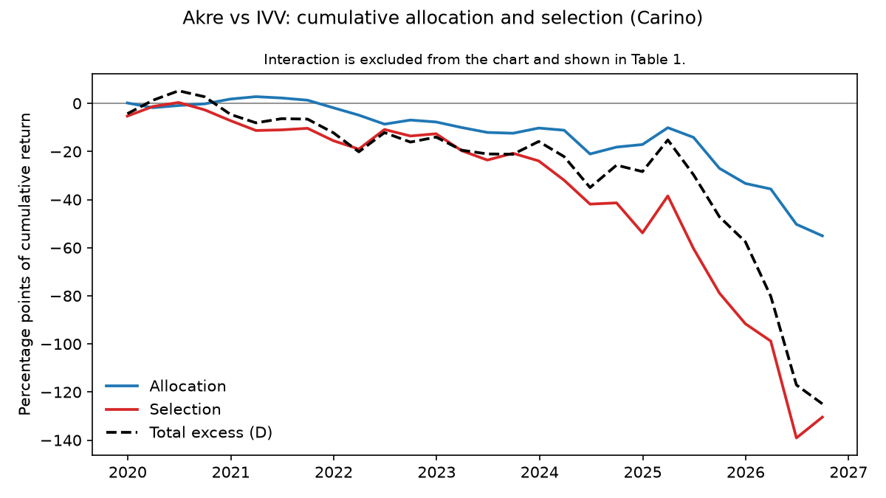
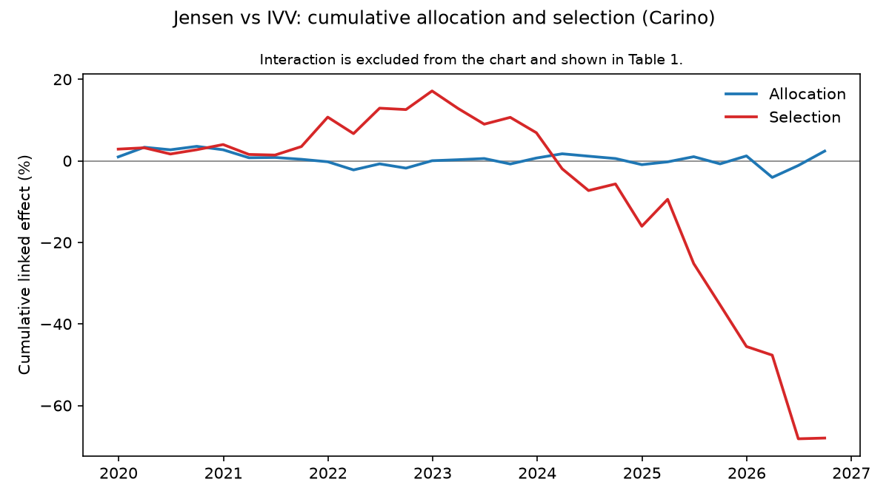
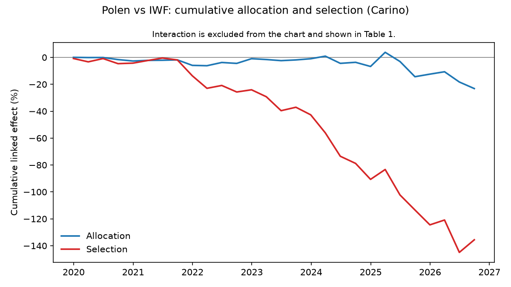

# Review — Section 4

## Section

Section 4, Brinson and linking, run from `instructions/04_section_4.md`. Precedence (rule 13): that file over `CLAUDE.md` amendments and `PLAN.md`, over the kickoff. 28 quarters throughout (amendment 7).

Outcome: **completed.** No rule 4 stop.

- All 3 funds passed the gate in Section 3, so all 3 are in scope (Section B).
- The Brinson identity holds on all 84 real fund-quarters. The worst error is 6.6e-17, against a tolerance of 1e-10.
- Both linked sets sum to D for every fund. The worst error is 1.6e-15, against 1e-10.
- Over the 28 quarters, every fund's book trails its benchmark's book:

  | fund | benchmark | R_P | R_B | D |
  |---|---|---|---|---|
  | Akre | IVV | +62.4% | +187.3% | −124.9 pp |
  | Jensen | IVV | +103.1% | +187.3% | −84.2 pp |
  | Polen | IWF | +92.5% | +234.0% | −141.5 pp |

  The rows behind these numbers are under D.2.

## Steps completed

- 4.0 `test_reused_ticker_never_prices_before_its_start` in `tests/test_returns_book.py` (Section A, answer 8) — `f732a39`
- 4.1 `attrib/brinson.py`, with `brinson_fachler` and `fill_empty` (Convention 4.11); `tests/test_brinson.py`; `tests/real_data.py`, the shared real-data helper — `970094c`
- 4.2 `attrib/linking.py`, with `carino` and `menchero` and their factor functions; `tests/test_linking.py` — `0b41765`
- 4.3 `run_all.py --section 4` writing `brinson_quarterly.csv`, `linked.csv`, the allocation, selection and interaction rows of `bootstrap.csv`, and Chart 1 per fund; an optional `idx` argument for `bootstrap_mean` — `1ac3cb7`

## Evidence

### Section 4 run

```
$ python scripts/run_all.py --section 4
section 1: all checks passed
section 2: all checks passed
benchmark quarters with |gap| > benchmark_gap_max (0.01):
  entity   t     q_start       q_end  book_return  nav_return       gap  unmapped_weight  unpriced_weight  delisted_weight
0    iwf  27  2026-03-31  2026-06-30      0.15426    0.165848 -0.011588         0.000852              0.0              0.0
section 3: all checks passed
section 4: all checks passed
```

`section_4` also checks 2 things on the real data, and either failure would be a rule 4 stop:

- the Brinson identity for every fund-quarter, against `book_quarterly.csv`, to 1e-10;
- each linked Total against D, to 1e-10.

Neither fired. Running `--section 4` a second time left `brinson_quarterly.csv`, `linked.csv`, `bootstrap.csv` and the 3 PNGs byte-identical (SHA-256 compared). The fresh clone regenerated every committed output with `git status` clean, the PNGs included.

### 4.1 test output and the hand-worked example

The rows printed by the new tests (`pytest -s`):

```
$ pytest -p socket --disable-socket -q -s tests/test_brinson.py tests/test_linking.py tests/test_returns_book.py::test_reused_ticker_never_prices_before_its_start
1000 cases, max |sum of effects - (r_P - r_B)| = 6.939e-17
.fund
akre      4.857226e-17
jensen    6.591949e-17
polen     4.683753e-17
.        allocation  selection  interaction
bucket
A           0.0044      0.008        0.002
B           0.0006     -0.004        0.001
C          -0.0000     -0.002       -0.000
.        allocation  selection  interaction
bucket
A           -0.002     -0.006       -0.001
B           -0.012      0.000       -0.000
C            0.000      0.000        0.039
D            0.000      0.000        0.000
.D = -0.292041, |Carino sum - D| = 3.886e-16
.D = -0.292041, |Menchero sum - D| = 1.110e-16
.     fund    method         D     abs_error
0    akre    carino -1.248979  4.440892e-16
1    akre  menchero -1.248979  0.000000e+00
2  jensen    carino -0.841934  8.881784e-16
3  jensen  menchero -0.841934  0.000000e+00
4   polen    carino -1.414782  1.554312e-15
5   polen  menchero -1.414782  6.661338e-16
.  bucket  allocation  selection  interaction
0      X   -0.000927  -0.000618    -0.000309
1      Y   -0.000773  -0.000309    -0.000155
.        allocation  selection  interaction
bucket
X         0.004100  -0.004406    -0.000061
Y        -0.000153  -0.000061    -0.000031
.carino
  bucket  allocation  selection  interaction
0      X         0.0        0.0          0.0
1      Y         0.0        0.0          0.0
menchero
  bucket    allocation     selection   interaction
0      X  4.857226e-17  3.469447e-17  1.734723e-17
1      Y  4.857226e-17  1.734723e-17  8.673617e-18
.carino: max |linked - input| = 6.939e-18
menchero: max |linked - input| = 4.163e-17
.30505 priced positions checked
Empty DataFrame
Columns: [entity, t, sec_id, yf_ticker, first_valid, q_start]
Index: []
.
12 passed, 1 warning in 104.30s (0:01:44)
```

- The hand-worked rows are those of `test_hand_worked_three_sector`, whose docstring has the arithmetic. The `-0.0000` entries are IEEE negative zeros, from 0 × (a negative number).
- The 4-bucket table is `test_empty_bucket_rules`. B is held only by the benchmark, so its selection and interaction are 0. C is held only by the fund, so its allocation is 0, because r_s^B := r_B. D is held by neither side and is 0 everywhere.

### D.1 linked.csv in full

```
      fund    method    bucket    allocation  selection  interaction         total
0     akre    carino     NoDur  4.166385e-02   0.000000     0.000000  4.166385e-02
1     akre    carino     Durbl  1.941335e-02   0.000000     0.000000  1.941335e-02
2     akre    carino     Manuf  2.732552e-03   0.000000     0.000000  2.732552e-03
3     akre    carino     Enrgy  1.700546e-04   0.000000     0.000000  1.700546e-04
4     akre    carino     Chems  3.784805e-02   0.008630    -0.008592  3.788561e-02
5     akre    carino     BusEq -2.936738e-01  -1.245880     0.781673 -7.578812e-01
6     akre    carino     Telcm  4.253595e-02   0.000000     0.000000  4.253595e-02
7     akre    carino     Utils  3.826179e-02   0.000000     0.000000  3.826179e-02
8     akre    carino     Shops  1.133084e-03  -0.020385    -0.057853 -7.710413e-02
9     akre    carino      Hlth  6.207505e-02   0.000000     0.000000  6.207505e-02
10    akre    carino     Money -7.201641e-02  -0.046940    -0.047389 -1.663463e-01
11    akre    carino     Other -4.307190e-01   0.005701    -0.062837 -4.878547e-01
12    akre    carino  Unmapped  1.349601e-18  -0.001326     0.001321 -5.397881e-06
13    akre    carino  Unpriced -1.621000e-18  -0.004152    -0.000373 -4.525148e-03
14    akre    carino     Total -5.505755e-01  -1.304352     0.605949 -1.248979e+00
15    akre  menchero     NoDur  4.919714e-02   0.000000     0.000000  4.919714e-02
16    akre  menchero     Durbl  1.663810e-02   0.000000     0.000000  1.663810e-02
17    akre  menchero     Manuf -4.256937e-04   0.000000     0.000000 -4.256937e-04
18    akre  menchero     Enrgy  6.950095e-03   0.000000     0.000000  6.950095e-03
19    akre  menchero     Chems  4.053770e-02   0.009814    -0.009704  4.064779e-02
20    akre  menchero     BusEq -3.162147e-01  -1.297971     0.809742 -8.044437e-01
21    akre  menchero     Telcm  4.767837e-02   0.000000     0.000000  4.767837e-02
22    akre  menchero     Utils  4.628898e-02   0.000000     0.000000  4.628898e-02
23    akre  menchero     Shops -2.207111e-03  -0.012017    -0.049525 -6.374871e-02
24    akre  menchero      Hlth  8.004398e-02   0.000000     0.000000  8.004398e-02
25    akre  menchero     Money -7.203539e-02  -0.049740    -0.050908 -1.726834e-01
26    akre  menchero     Other -4.148515e-01  -0.001055    -0.074549 -4.904556e-01
27    akre  menchero  Unmapped  1.382205e-18  -0.001385     0.001379 -5.599747e-06
28    akre  menchero  Unpriced -1.486686e-18  -0.004559    -0.000101 -4.660450e-03
29    akre  menchero     Total -5.184001e-01  -1.356914     0.626335 -1.248979e+00
30  jensen    carino     NoDur -3.509592e-02  -0.014656    -0.013370 -6.312180e-02
31  jensen    carino     Durbl  2.224784e-02  -0.025859     0.024808  2.119673e-02
32  jensen    carino     Manuf -3.539893e-02  -0.152108     0.038785 -1.487221e-01
33  jensen    carino     Enrgy  1.576026e-03   0.000000     0.000000  1.576026e-03
34  jensen    carino     Chems -1.113195e-02  -0.002742    -0.001085 -1.495823e-02
35  jensen    carino     BusEq  5.590584e-02  -0.293589    -0.047742 -2.854252e-01
36  jensen    carino     Telcm  4.634732e-02   0.000000     0.000000  4.634732e-02
37  jensen    carino     Utils  4.222535e-02   0.000000     0.000000  4.222535e-02
38  jensen    carino     Shops -2.315898e-02  -0.106154     0.043537 -8.577552e-02
39  jensen    carino      Hlth -2.515842e-02  -0.105409    -0.110713 -2.412805e-01
40  jensen    carino     Money  6.489835e-02   0.041611    -0.083453  2.305684e-02
41  jensen    carino     Other -7.936677e-02  -0.018092    -0.039048 -1.365065e-01
42  jensen    carino  Unmapped  1.416693e-18  -0.001897     0.001362 -5.352785e-04
43  jensen    carino  Unpriced -2.450587e-18  -0.000964     0.000954 -1.067468e-05
44  jensen    carino     Total  2.388976e-02  -0.679860    -0.185964 -8.419335e-01
45  jensen  menchero     NoDur -4.119879e-02  -0.014698    -0.013085 -6.898216e-02
46  jensen  menchero     Durbl  1.982016e-02  -0.027829     0.026749  1.873971e-02
47  jensen  menchero     Manuf -3.166063e-02  -0.141897     0.038727 -1.348309e-01
48  jensen  menchero     Enrgy  7.414527e-03   0.000000     0.000000  7.414527e-03
49  jensen  menchero     Chems -1.236408e-02  -0.004455    -0.000282 -1.710160e-02
50  jensen  menchero     BusEq  5.986007e-02  -0.312451    -0.049356 -3.019471e-01
51  jensen  menchero     Telcm  5.158519e-02   0.000000     0.000000  5.158519e-02
52  jensen  menchero     Utils  4.987886e-02   0.000000     0.000000  4.987886e-02
53  jensen  menchero     Shops -2.163432e-02  -0.099744     0.042128 -7.925118e-02
54  jensen  menchero      Hlth -4.632081e-02  -0.098911    -0.103972 -2.492039e-01
55  jensen  menchero     Money  6.200808e-02   0.023439    -0.073264  1.218359e-02
56  jensen  menchero     Other -7.587899e-02  -0.015589    -0.038404 -1.298724e-01
57  jensen  menchero  Unmapped  1.474295e-18  -0.002054     0.001521 -5.332754e-04
58  jensen  menchero  Unpriced -2.222662e-18  -0.001322     0.001309 -1.288220e-05
59  jensen  menchero     Total  2.150927e-02  -0.695513    -0.167930 -8.419335e-01
60   polen    carino     NoDur  4.961529e-02   0.029381    -0.030143  4.885271e-02
61   polen    carino     Durbl -3.461432e-02  -0.122101     0.120838 -3.587738e-02
62   polen    carino     Manuf -3.667939e-02   0.020835    -0.003008 -1.885263e-02
63   polen    carino     Enrgy  1.298879e-03  -0.002248     0.002186  1.236913e-03
64   polen    carino     Chems  2.759625e-02   0.022559    -0.021982  2.817335e-02
65   polen    carino     BusEq -6.751929e-02  -1.106970     0.173392 -1.001097e+00
66   polen    carino     Telcm  1.652861e-02  -0.000120    -0.000114  1.629512e-02
67   polen    carino     Utils -1.818878e-03  -0.002529     0.002523 -1.824693e-03
68   polen    carino     Shops  1.403805e-02  -0.040876     0.030653  3.815274e-03
69   polen    carino      Hlth -2.156176e-02  -0.084698    -0.095987 -2.022469e-01
70   polen    carino     Money  3.423816e-02  -0.058146     0.040595  1.668737e-02
71   polen    carino     Other -2.128110e-01  -0.006358    -0.049952 -2.691214e-01
72   polen    carino  Unmapped  2.040510e-18  -0.004713     0.003890 -8.227968e-04
73   polen    carino  Unpriced  3.580874e-18   0.000061    -0.000061  8.423776e-08
74   polen    carino     Total -2.316894e-01  -1.355923     0.172830 -1.414782e+00
75   polen  menchero     NoDur  6.147521e-02   0.060887    -0.061509  6.085277e-02
76   polen  menchero     Durbl -4.970561e-02  -0.136300     0.134987 -5.101855e-02
77   polen  menchero     Manuf -3.233761e-02   0.024790    -0.004190 -1.173758e-02
78   polen  menchero     Enrgy  2.717620e-03  -0.002154     0.002104  2.667621e-03
79   polen  menchero     Chems  3.065696e-02   0.022445    -0.021945  3.115671e-02
80   polen  menchero     BusEq -7.614418e-02  -1.129575     0.172712 -1.033008e+00
81   polen  menchero     Telcm  1.568732e-02  -0.001606     0.001511  1.559247e-02
82   polen  menchero     Utils -5.611405e-04  -0.001836     0.001843 -5.541238e-04
83   polen  menchero     Shops  1.311883e-02  -0.019223     0.029419  2.331506e-02
84   polen  menchero      Hlth -4.039400e-02  -0.067902    -0.084232 -1.925282e-01
85   polen  menchero     Money  3.890696e-02  -0.054489     0.025454  9.872346e-03
86   polen  menchero     Other -2.321692e-01   0.002141    -0.038558 -2.685856e-01
87   polen  menchero  Unmapped  1.962432e-18  -0.004587     0.003780 -8.074710e-04
88   polen  menchero  Unpriced  3.570273e-18   0.000066    -0.000066  9.032538e-08
89   polen  menchero     Total -2.687488e-01  -1.307342     0.161309 -1.414782e+00
```

### D.2 D, R_P, R_B and the Total rows

```
     fund benchmark   T       R_P       R_B         D
0    akre       ivv  28  0.624255  1.873234 -1.248979
1  jensen       ivv  28  1.031300  1.873234 -0.841934
2   polen       iwf  28  0.925111  2.339893 -1.414782

akre
               carino  menchero  carino_minus_menchero
allocation  -0.550576 -0.518400          -3.217544e-02
selection   -1.304352 -1.356914           5.256195e-02
interaction  0.605949  0.626335          -2.038651e-02
total       -1.248979 -1.248979           4.440892e-16

jensen
               carino  menchero  carino_minus_menchero
allocation   0.023890  0.021509           2.380490e-03
selection   -0.679860 -0.695513           1.565294e-02
interaction -0.185964 -0.167930          -1.803343e-02
total       -0.841934 -0.841934           1.110223e-15

polen
               carino  menchero  carino_minus_menchero
allocation  -0.231689 -0.268749           3.705947e-02
selection   -1.355923 -1.307342          -4.858042e-02
interaction  0.172830  0.161309           1.152095e-02
total       -1.414782 -1.414782          -4.440892e-16
```

### D.3 5 buckets with the largest |Carino - Menchero| in any effect

```

akre
        allocation  selection  interaction  max_abs_diff
bucket                                                  
BusEq     0.022541   0.052091    -0.028070      0.052091
Hlth     -0.017969   0.000000     0.000000      0.017969
Other    -0.015868   0.006756     0.011712      0.015868
Shops     0.003340  -0.008368    -0.008328      0.008368
Utils    -0.008027   0.000000     0.000000      0.008027

jensen
        allocation  selection  interaction  max_abs_diff
bucket                                                  
Hlth      0.021162  -0.006498    -0.006741      0.021162
BusEq    -0.003954   0.018862     0.001614      0.018862
Money     0.002890   0.018172    -0.010189      0.018172
Manuf    -0.003738  -0.010211     0.000058      0.010211
Utils    -0.007654   0.000000     0.000000      0.007654

polen
        allocation  selection  interaction  max_abs_diff
bucket                                                  
NoDur    -0.011860  -0.031506     0.031366      0.031506
BusEq     0.008625   0.022605     0.000681      0.022605
Shops     0.000919  -0.021653     0.001234      0.021653
Other     0.019358  -0.008500    -0.011394      0.019358
Hlth      0.018832  -0.016796    -0.011754      0.018832
```

### D.4 bootstrap rows

```
      fund       series      mean       p05       p95
0     akre   allocation -0.008580 -0.016300 -0.001535
1     akre    selection -0.022455 -0.037373 -0.009472
2     akre  interaction  0.010457  0.002838  0.018024
4   jensen   allocation  0.000287 -0.002583  0.003178
5   jensen    selection -0.011029 -0.023242  0.001114
6   jensen  interaction -0.002498 -0.006237  0.000853
8    polen   allocation -0.003876 -0.008398  0.000367
9    polen    selection -0.018825 -0.027429 -0.009709
10   polen  interaction  0.002321 -0.001592  0.006231
```

### D.5 largest and most negative single-quarter selection totals

```

akre: 3 largest
     t       q_end  selection  allocation  interaction
21  22  2025-03-31   0.072853    0.033655    -0.042987
27  28  2026-09-30   0.044975   -0.020061    -0.056561
10  11  2022-06-30   0.036398   -0.029994     0.027784
akre: 3 most negative
     t       q_end  selection  allocation  interaction
26  27  2026-06-30  -0.160090   -0.058607     0.068004
22  23  2025-06-30  -0.095038   -0.016314     0.044588
25  26  2026-03-31  -0.074955   -0.025838    -0.026627

jensen: 3 largest
     t       q_end  selection  allocation  interaction
10  11  2022-06-30   0.045658    0.007378    -0.017786
8    9  2021-12-31   0.045587   -0.004409    -0.001407
21  22  2025-03-31   0.030584    0.003267    -0.005206
jensen: 3 most negative
     t       q_end  selection  allocation  interaction
22  23  2025-06-30  -0.076952    0.006573     0.008631
26  27  2026-06-30  -0.067641    0.016579     0.011191
17  18  2024-03-28  -0.055154    0.005820    -0.006222

polen: 3 largest
     t       q_end  selection  allocation  interaction
27  28  2026-09-30   0.050399   -0.017782    -0.002628
2    3  2020-06-30   0.035225    0.000767    -0.026311
12  13  2022-12-30   0.016746    0.028292    -0.048665
polen: 3 most negative
     t       q_end  selection  allocation  interaction
18  19  2024-06-28  -0.073753   -0.026712     0.019183
8    9  2021-12-31  -0.065499   -0.022111     0.023564
9   10  2022-03-31  -0.056220   -0.004858     0.014356
```

### D.6 5 largest FF12 Other holdings at t = 28

```

akre: Other weight at t = 28 = 0.560060
      sec_id ticker                     name   sic map_status    weight
3  57636Q104     MA  MASTERCARD INCORPORATED  7389     mapped  0.200126
4  615369105    MCO              MOODYS CORP  7320     mapped  0.102603
2  303250104   FICO          FAIR ISAAC CORP  7389     mapped  0.084651
5  92826C839      V                 VISA INC  7389     mapped  0.074631
1  22160N109   CSGP         COSTAR GROUP INC  7389     mapped  0.064879

jensen: Other weight at t = 28 = 0.112099
      sec_id ticker                            name   sic map_status    weight
5  57636Q104     MA                  Mastercard Inc  7389     mapped  0.043293
9  94106L109     WM                Waste Management  4953     mapped  0.034096
2  294429105    EFX                     Equifax Inc  7320     mapped  0.014258
1  11133T103     BR  Broadridge Financial Solutions  7389     mapped  0.012620
7  89834G562   JGRW       Jensen Quality Growth ETF   NaN     no_cik  0.003582

polen: Other weight at t = 28 = 0.215842
       sec_id ticker                     name   sic map_status    weight
40  92826C839      V                 VISA INC  7389     mapped  0.053355
24  57636Q104     MA  MASTERCARD INCORPORATED  7389     mapped  0.050514
22  55354G100   MSCI                 MSCI INC  7389     mapped  0.032404
6   22160N109   CSGP         COSTAR GROUP INC  7389     mapped  0.021365
0   009066101   ABNB               AIRBNB INC  7340     mapped  0.020334

Other weight by fund at t = 12 and t = 28 (buckets.csv)
      entity   t bucket    weight         r
165     akre  12  Other  0.389722 -0.077142
389     akre  28  Other  0.560060 -0.038260
1341  jensen  12  Other  0.171170 -0.054018
1565  jensen  28  Other  0.112099  0.015081
1733   polen  12  Other  0.282737  0.016389
1957   polen  28  Other  0.215842  0.021305

akre t = 12, every Other position
      sec_id ticker                     name   sic    weight
1  57636Q104     MA  MASTERCARD INCORPORATED  7389  0.148233
2  615369105    MCO              MOODYS CORP  7320  0.124308
3  92826C839      V                 VISA INC  7389  0.082753
0  22160N109   CSGP         COSTAR GROUP INC  7389  0.034427
```

### D.7 Chart 1







## Tests run

`pytest -p socket --disable-socket -q`:

```
..............................................................           [100%]
============================== warnings summary ===============================
.venv\Lib\site-packages\_pytest\config\__init__.py:864
  C:\Utkarsh\10. Quant Projects\6) Attribution Engine On Real Holdings\repo-clone\.venv\Lib\site-packages\_pytest\config\__init__.py:864: PytestAssertRewriteWarning: Module already imported so cannot be rewritten; socket
    self.import_plugin(arg, consider_entry_points=True)

-- Docs: https://docs.pytest.org/en/stable/how-to/capture-warnings.html
62 passed, 1 warning in 46.36s
```

That is the 50 tests of Sections 1 to 3, plus 12 new ones:

- `test_returns_book.py`: `test_reused_ticker_never_prices_before_its_start`. It checked 30505 priced positions and found 0 violations.
- `test_brinson.py`: `test_identity_random_1000`, `test_identity_every_real_fund_quarter`, `test_hand_worked_three_sector` and `test_empty_bucket_rules`.
- `test_linking.py`: `test_carino_sums_to_D_synthetic`, `test_menchero_sums_to_D_synthetic`, `test_linked_sums_to_D_real`, `test_carino_limit`, `test_equal_period_uses_limit`, `test_menchero_limit` and `test_single_period_unchanged`.

## Fresh-clone check

Per E, the 4 step commits were pushed first (`9ccd44c..1ac3cb7`). `git ls-remote` then returned `1ac3cb72c7f9c994210fe6250d86a3328db7e007` for `refs/heads/main`, equal to local `HEAD`, and GitHub was cloned into `C:\t\s4`. The install output is trimmed to its last lines:

```
$ git clone -q https://github.com/uty101/Attribution-Engine-On-Real-Holdings.git /c/t/s4
$ git log --oneline -1
1ac3cb7 step 4.3: brinson_quarterly, linked, effect bootstrap rows and Chart 1 per fund
$ uv venv --python 3.12
Using CPython 3.12.13
Creating virtual environment at: .venv
Activate with: .venv\Scripts\activate
$ uv pip install -r requirements-lock.txt
 + websockets==17.1
 + wrapt==2.5.0
 + yfinance==1.7.0
$ uv pip install -e . --no-deps
 + attrib==0.0.0 (from file:///C:/t/s4)
$ .venv/Scripts/python.exe -m pytest -p socket --disable-socket -q
..............................................................           [100%]
============================== warnings summary ===============================
.venv\Lib\site-packages\_pytest\config\__init__.py:864
  C:\t\s4\.venv\Lib\site-packages\_pytest\config\__init__.py:864: PytestAssertRewriteWarning: Module already imported so cannot be rewritten; socket
    self.import_plugin(arg, consider_entry_points=True)

-- Docs: https://docs.pytest.org/en/stable/how-to/capture-warnings.html
62 passed, 1 warning in 142.96s (0:02:22)
$ .venv/Scripts/python.exe scripts/run_all.py --section 4
section 1: all checks passed
section 2: all checks passed
benchmark quarters with |gap| > benchmark_gap_max (0.01):
  entity   t     q_start       q_end  book_return  nav_return       gap  unmapped_weight  unpriced_weight  delisted_weight
0    iwf  27  2026-03-31  2026-06-30      0.15426    0.165848 -0.011588         0.000852              0.0              0.0
section 3: all checks passed
section 4: all checks passed
$ git status --short
$
```

## Runtime per step

These are wall-clock times on this machine. Earlier sessions saw them vary by up to 5 times between identical runs.

- 4.0: the new test takes about 12 s, mostly the shared real-book rebuild.
- 4.1 and 4.2: `tests/test_brinson.py` takes 20 s and `tests/test_linking.py` 12 s, each run on its own. Run together, the rebuild happens once.
- 4.3: `section_4` alone takes 2.7 s, including the 3 charts with 28 Carino prefix links each. `run_all.py --section 4` from scratch takes 35 s.
- Suite: 46 s locally and 143 s in the fresh clone.

## Deviations from PLAN.md

Deviations accepted in earlier sessions are not repeated here.

New in session 4. Each is a choice the instructions do not make, listed for confirmation:

1. **A step 4.0 commit.** Section A, answer 8 asks for `test_reused_ticker_never_prices_before_its_start` but places it in no step. It went in its own commit before 4.1, following the 3.0 precedent, so the Brinson commit holds only Brinson.
2. **`bootstrap_mean` gained an optional keyword `idx`.** Section B asks for 1 call to `stationary_bootstrap_indices` per fund, shared by the 3 series. It also asks for `bootstrap_mean` to return mean, p05 and p95. The D-20 signature draws its own indices, so `idx=None` keeps the old behaviour (the gap rows are unchanged, byte for byte). `section_4` draws once and passes the same array 3 times. The draws are identical to 3 separate seeded calls, since n, seed and reps are the same; the change only makes "1 call" literal.
3. **`zero_tol` is an optional keyword on `carino` and `menchero`,** after the kickoff 6.1 arguments. Its default is 1e-12, written as a literal because kickoff 5.6 writes it inside the formula (rule 6 exception). `run_all` passes `linking.zero_tol`. The Menchero limit Σ d_t² < 1e-24 is the module constant `SUM_D2_TOL`, citing 5.6; it has no config key.
4. **Extra public helpers.** These are `fill_empty` and `EFFECTS` in `attrib/brinson.py`, and `carino_factors` and `menchero_factors` in `attrib/linking.py`. `fill_empty` is the single place where Convention 4.11 is applied: `brinson_fachler` uses it, and so does `run_all` for the `rP` and `rB` columns.
5. **`brinson_quarterly.csv` writes `rP` and `rB` after Convention 4.11.** These are the values the formulas used, so each row reproduces its 3 effects by hand. `buckets.csv` keeps them blank where the weight is 0.
6. **Linking output order.** The result has 1 row per bucket in order of first appearance in `effects`, which is Convention 4.6 order. Unmapped and Unpriced are included. `linked.csv` adds the `Total` row (column sums) and `total` = allocation + selection + interaction. Rows are ordered by fund (config order), then method (`carino`, `menchero`), then bucket.
7. **`bootstrap.csv` row order.** Rows are ordered by fund (config order), then series in kickoff 6.2 order: allocation, selection, interaction, gap. Section 3 wrote only the gap rows. Running `--section 3` alone rewrites the file with only those rows, and `--section 4` adds the rest back.
8. **Chart 1 details not in Section B:**
   - x is `q_end` of quarter k from QUARTERS;
   - the names are the fund id capitalised and the benchmark's ETF ticker ("Akre vs IVV");
   - the y label is "Cumulative linked effect (%)";
   - the subtitle reads "Interaction is excluded from the chart and shown in Table 1.";
   - the lines are blue (allocation) and red (selection), with a grey zero line and the legend at the best location.

   The plotting function is `chart_1` in `scripts/run_all.py`. Section 7 decides how the report embeds it.
9. **`test_equal_period_uses_limit` (PLAN 4.2) is kept beside `test_carino_limit` (instructions 04).** In `test_carino_limit` the equal quarter's effects are all 0, so it cannot tell whether k_t took the limit. `test_equal_period_uses_limit` gives that quarter effects that are nonzero but cancel, and checks the linked bucket against k_2 = 1/(1 + r_P,2) by hand. `test_menchero_limit` runs Carino on the same D = 0 series as well.
10. **`tests/real_data.py`** is a helper module, not a test file. It rebuilds BUCKETS for all 5 entities through `book_quarter`, `apply_return_overrides` and `bucket_table`, reusing `_real()` from `tests/test_returns_book.py`, so one pytest run rebuilds the books once. It applies the overrides file as `run_all` does; there are no `quarter_return` rows.

## Not verified

- **Carino against Menchero** is reported, not tested (kickoff 5.6). Their per-effect Totals differ by up to 5.3 pp for Akre's selection and 4.9 pp for Polen's (D.2). That is small next to |D| of 84 to 141 pp, but it is not "a few bp". With D this large the 2 methods spread the cross-terms differently.
- **Whether the large negative selection reflects the funds or the 13F view.** The book returns are buy-and-hold from quarter-start books (Section 3), and every fund passed its NAV gate. The intervals in D.4 are over the unlinked quarterly totals. Nothing here separates selection from the intra-quarter trading the 13F cannot see.
- **The Other bucket.** At t = 28 it holds 56% of Akre's book, mostly MA, MCO, FICO, V and CSGP on SIC 7389 and 7320 (D.6). Those SICs fall outside the FF12 BusEq ranges, so French's mapping puts them in Other. D.6 lists the names; no other mapping was tried.

## Open questions

1. **Deviation 2:** is the `idx` keyword on `bootstrap_mean` acceptable, or should the shared draws live somewhere else?
2. **Deviation 5:** should `brinson_quarterly.csv` carry `rP` and `rB` after the fill, as built, or blank like `buckets.csv`?
3. **Deviation 8:** the Chart 1 naming ("Akre vs IVV") and the use of `q_end` on the x axis.
4. **The bootstrap intervals (D.4) that exclude 0:**
   - Akre's mean quarterly allocation (−0.86%, interval −1.63% to −0.15%), selection (−2.25%, −3.74% to −0.95%) and interaction (+1.05%, +0.28% to +1.80%);
   - Polen's selection (−1.88%, −2.74% to −0.97%).

   Jensen's 3 intervals all contain 0. This is reported for the write-up; nothing depends on it in Section 4.

## Files changed

- 4.0: `tests/test_returns_book.py`
- 4.1: `attrib/brinson.py` (new), `tests/test_brinson.py` (new), `tests/real_data.py` (new)
- 4.2: `attrib/linking.py` (new), `tests/test_linking.py` (new)
- 4.3: `attrib/bootstrap.py`, `scripts/run_all.py`, `outputs/tables/bootstrap.csv`, `outputs/tables/brinson_quarterly.csv` (new), `outputs/tables/linked.csv` (new), `outputs/figures/akre_alloc_vs_sel.png`, `jensen_alloc_vs_sel.png`, `polen_alloc_vs_sel.png` (new)
- Session end: `review/section_4.md`, `instructions/04_section_4.status.md`

`CLAUDE.md`, `PLAN.md`, `config.toml` and `decisions/OPEN.md` are unchanged.

## Reviewer reads

1. `instructions/04_section_4.status.md`
2. This file: the Deviations, then the Open questions.
3. Evidence D.2, D.4 and D.7.
4. `attrib/brinson.py` and `attrib/linking.py`.
5. `section_4` and `chart_1` in `scripts/run_all.py`.
6. `tests/test_brinson.py`, `tests/test_linking.py`, then `tests/real_data.py`.
