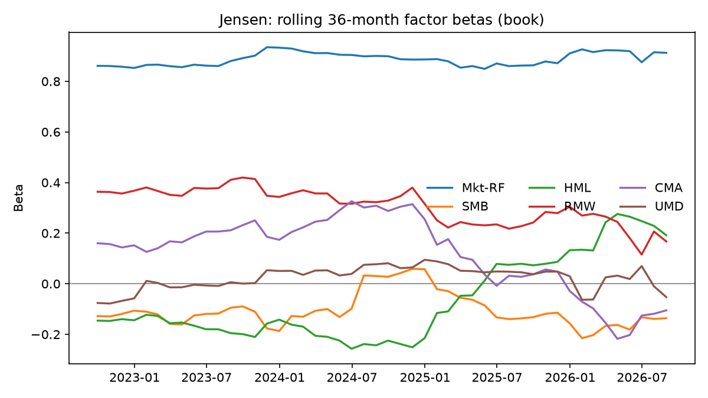
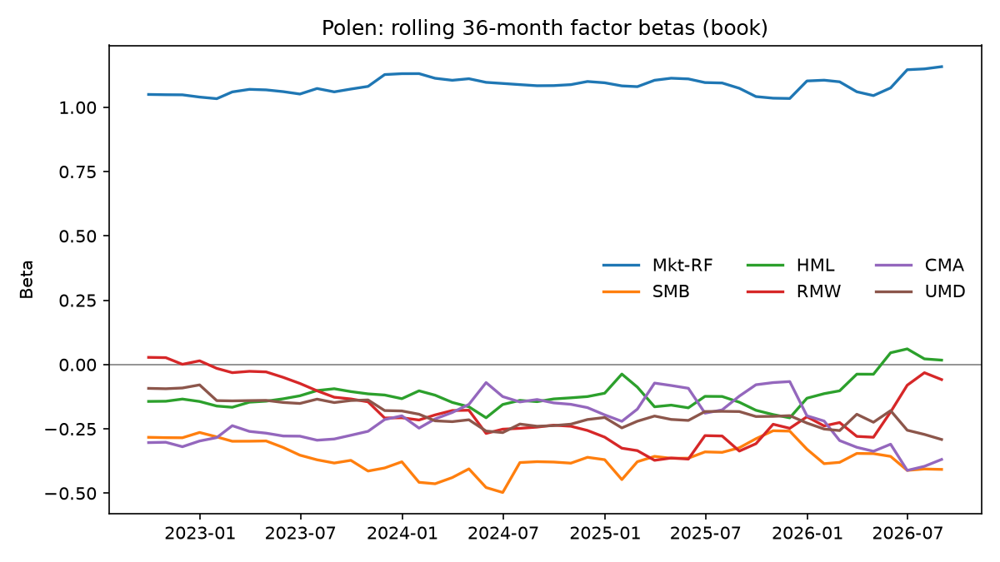
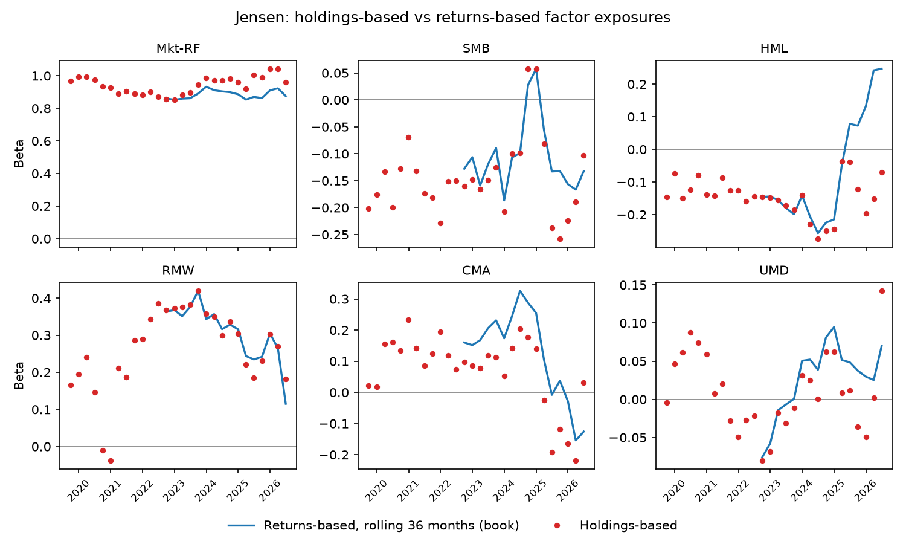
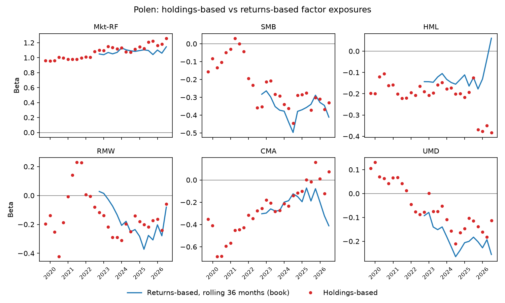

# Review — Section 5

## Section

Section 5, Factor attribution, run from `instructions/05_section_5.md`. Precedence (rule 13): that file over the `CLAUDE.md` amendments and `PLAN.md`, which beat the kickoff. The monthly sample is October 2019 to August 2026, which is 83 months (Section C).

Outcome: **completed.** No rule 4 stop.

- Step 5.0 fixed Chart 1 and added `filled` to `brinson_quarterly.csv`. `run_all.py --section 4` still passes every check.
- All 3 funds passed the gate in Section 3, so all 3 are in scope.
- `factor_fit.csv` has 8 series. Each book series and the Jensen and Polen NAV series have 83 months. Akre's NAV series has 80, because 2025-08 to 2025-10 are dropped (D-33).
- `rolling_betas.csv` has 48 windows for each of the 5 book series, from 2022-09 to 2026-08, as Section C expects.
- The IVV sanity check holds:
  - the full-sample returns-based market beta of `ivv_book` is 0.988;
  - the holdings-based beta is between 0.962 and 1.107 at every h.

  The rows are under E.5.
- Running `--section 5` twice gave byte-identical CSVs and PNGs (SHA-256 compared over every file in `outputs/tables` and `outputs/figures`).

## Steps completed

- 5.0 Chart 1 gains the dashed black "Total excess (D)" line and the y label "Percentage points of cumulative return"; `brinson_quarterly.csv` gains `filled` after `rB` — `6771aea`
- 5.1 `returns_based`, `rolling_betas` and `factor_contrib_by_year` in `attrib/factors.py`; `tests/test_factors.py`; `section_5` writing `factor_fit.csv`, `factor_by_year.csv`, `rolling_betas.csv` and Chart 2 per fund — `8640da6`
- 5.2 `stock_betas`, `fallback_betas` and `holdings_exposure` in `attrib/factors.py`; `tests/test_exposures.py`; `holdings_exposures.csv`, the exposures chart per fund and the IVV sanity check — `dbd4e89`

## Evidence

### Section 5 run

```
$ python scripts/run_all.py --section 5
section 1: all checks passed
section 2: all checks passed
benchmark quarters with |gap| > benchmark_gap_max (0.01):
  entity   t     q_start       q_end  book_return  nav_return       gap  unmapped_weight  unpriced_weight  delisted_weight
0    iwf  27  2026-03-31  2026-06-30      0.15426    0.165848 -0.011588         0.000852              0.0              0.0
section 3: all checks passed
section 4: all checks passed
IVV sanity check (instructions/05, D 5.2): full-sample returns-based ivv_book market beta
   series_id coef     value    se_hac  n_months
43  ivv_book  mkt  0.988494  0.009105        83
beta coverage per side, the largest value over the holdings dates:
                  fallback_weight  no_beta_weight  n_fallback  n_no_beta
fund   side                                                             
akre   fund              0.011681        0.000000           2          0
       benchmark         0.007097        0.000000           7          0
jensen fund              0.003582        0.000000           1          0
       benchmark         0.007097        0.000000           7          0
polen  fund              0.044034        0.000099          11          1
       benchmark         0.016652        0.000000          38          0
holdings-based exposures at the review dates (instructions/05, E 4):
       fund holdings_date       side       mkt       smb       hml       rmw       cma       umd  excluded_weight
0      akre    2019-09-30       fund  0.800276 -0.274477 -0.325880 -0.079413 -0.037351  0.054570         0.003761
1      akre    2019-09-30  benchmark  0.962341 -0.151240 -0.029865  0.054254 -0.035859  0.004638         0.041684
2      akre    2019-09-30     active -0.162065 -0.123237 -0.296015 -0.133667 -0.001492  0.049931              NaN
39     akre    2022-12-31       fund  1.042226 -0.386213  0.000190  0.209340 -0.054141 -0.095394         0.004941
40     akre    2022-12-31  benchmark  0.967218 -0.138525  0.012534  0.066589  0.122153 -0.086404         0.015410
41     akre    2022-12-31     active  0.075009 -0.247687 -0.012343  0.142751 -0.176295 -0.008990              NaN
81     akre    2026-06-30       fund  0.990083 -0.091279  0.431155  0.097289 -0.543890 -0.181050         0.000000
82     akre    2026-06-30  benchmark  1.106810 -0.059983 -0.051323 -0.052242  0.058968  0.092226         0.001123
83     akre    2026-06-30     active -0.116728 -0.031296  0.482477  0.149531 -0.602858 -0.273276              NaN
84   jensen    2019-09-30       fund  0.966986 -0.201549 -0.146718  0.165947  0.021366 -0.004124         0.000430
85   jensen    2019-09-30  benchmark  0.962341 -0.151240 -0.029865  0.054254 -0.035859  0.004638         0.041684
86   jensen    2019-09-30     active  0.004645 -0.050309 -0.116853  0.111693  0.057225 -0.008762              NaN
123  jensen    2022-12-31       fund  0.854656 -0.147889 -0.148722  0.372712  0.086460 -0.068182         0.000969
124  jensen    2022-12-31  benchmark  0.967218 -0.138525  0.012534  0.066589  0.122153 -0.086404         0.015410
125  jensen    2022-12-31     active -0.112562 -0.009364 -0.161256  0.306124 -0.035694  0.018222              NaN
165  jensen    2026-06-30       fund  0.962188 -0.103460 -0.070347  0.181215  0.032251  0.142302         0.000507
166  jensen    2026-06-30  benchmark  1.106810 -0.059983 -0.051323 -0.052242  0.058968  0.092226         0.001123
167  jensen    2026-06-30     active -0.144623 -0.043477 -0.019024  0.233457 -0.026717  0.050076              NaN
168   polen    2019-09-30       fund  0.961304 -0.157324 -0.198481 -0.196417 -0.351630  0.105087         0.000177
169   polen    2019-09-30  benchmark  1.007530 -0.148029 -0.181542 -0.010189 -0.326262  0.092585         0.045211
170   polen    2019-09-30     active -0.046226 -0.009295 -0.016940 -0.186228 -0.025368  0.012503              NaN
207   polen    2022-12-31       fund  1.094789 -0.213771 -0.207911 -0.138602 -0.178900  0.001530         0.000712
208   polen    2022-12-31  benchmark  1.047355 -0.142994 -0.226946  0.094293  0.034430 -0.048746         0.014655
209   polen    2022-12-31     active  0.047433 -0.070778  0.019034 -0.232894 -0.213329  0.050276              NaN
249   polen    2026-06-30       fund  1.260513 -0.330540 -0.382199 -0.058993  0.072590 -0.113078         0.002927
250   polen    2026-06-30  benchmark  1.294779 -0.012645 -0.556976 -0.235288  0.093377  0.114401         0.000231
251   polen    2026-06-30     active -0.034265 -0.317895  0.174777  0.176295 -0.020787 -0.227478              NaN
IVV sanity check (instructions/05, D 5.2): holdings-based ivv_book market beta at every h
   holdings_date       mkt  excluded_weight
1     2019-09-30  0.962341         0.041684
4     2019-12-31  0.971680         0.036303
7     2020-03-31  0.972749         0.031404
10    2020-06-30  0.985592         0.026920
13    2020-09-30  0.981141         0.026419
16    2020-12-31  1.017601         0.026963
19    2021-03-31  0.994829         0.027243
22    2021-06-30  0.993987         0.025799
25    2021-09-30  1.004838         0.023250
28    2021-12-31  1.020114         0.021403
31    2022-03-31  1.028978         0.019823
34    2022-06-30  0.984796         0.018877
37    2022-09-30  1.002380         0.018438
40    2022-12-31  0.967218         0.015410
43    2023-03-31  1.003315         0.014515
46    2023-06-30  1.020861         0.013448
49    2023-09-30  1.021903         0.013292
52    2023-12-31  1.029779         0.010456
55    2024-03-31  1.045788         0.009461
58    2024-06-30  1.069315         0.006979
61    2024-09-30  1.057377         0.006509
64    2024-12-31  1.069690         0.006150
67    2025-03-31  1.041491         0.006388
70    2025-06-30  1.063114         0.005078
73    2025-09-30  1.070927         0.003166
76    2025-12-31  1.016959         0.002607
79    2026-03-31  0.992843         0.002546
82    2026-06-30  1.106810         0.001123
section 5: all checks passed
```

`section_5` adds 2 rule 4 checks on the real data. Neither fired:

- in every series of Table 2, each year's 6 contributions plus alpha plus residual equal the year's excess return, to 1e-12;
- no `yf_ticker` sits in 2 FF12 buckets in the same book. Weights are summed by `yf_ticker`, so that sum must be unambiguous.

### 5.0 Chart 1 and the `filled` column

The last point of the D line is D_28. Below, D_28 is computed from `book_quarterly.csv` with `chart_1`'s formula (both books compounded over quarters 1 to 28) and set against the Carino Total in `linked.csv`. Akre ends at −124.9 pp, the value the reviewer cited in Section A:

```
     fund benchmark  quarters     D_28_pp  carino_total_pp      abs_diff
0    akre       ivv        28 -124.897865      -124.897865  1.554312e-15
1  jensen       ivv        28  -84.193353       -84.193353  2.220446e-16
2   polen       iwf        28 -141.478221      -141.478221  1.332268e-15
```

The `filled` counts, by fund and by which side was empty:

```
        rows  filled  fund_empty  bench_empty  both_empty  check_filled_eq_fund_or_bench
fund                                                                                    
akre     392     253         253            1           1                           True
jensen   392     112         111            1           0                           True
polen    392      80          80            5           5                           True
```

### E.1 `factor_fit.csv` in full

```
      series_id series_kind   coef     value    se_hac       t_hac        r2  resid_vol_ann  n_months
0     akre_book        book  alpha -0.004561  0.003276   -1.392261  0.764338       0.096548        83
1     akre_book        book    mkt  0.955048  0.074189   12.873105  0.764338       0.096548        83
2     akre_book        book    smb -0.053411  0.157573   -0.338961  0.764338       0.096548        83
3     akre_book        book    hml  0.007729  0.107785    0.071712  0.764338       0.096548        83
4     akre_book        book    rmw  0.325184  0.126839    2.563749  0.764338       0.096548        83
5     akre_book        book    cma -0.101015  0.143813   -0.702406  0.764338       0.096548        83
6     akre_book        book    umd -0.126014  0.089965   -1.400708  0.764338       0.096548        83
7      akre_nav         nav  alpha -0.002974  0.003175   -0.936598  0.769862       0.092097        80
8      akre_nav         nav    mkt  0.903782  0.078477   11.516479  0.769862       0.092097        80
9      akre_nav         nav    smb -0.186352  0.169064   -1.102260  0.769862       0.092097        80
10     akre_nav         nav    hml -0.008160  0.105016   -0.077704  0.769862       0.092097        80
11     akre_nav         nav    rmw  0.189239  0.133999    1.412243  0.769862       0.092097        80
12     akre_nav         nav    cma -0.173563  0.130281   -1.332229  0.769862       0.092097        80
13     akre_nav         nav    umd -0.174857  0.112483   -1.554520  0.769862       0.092097        80
14  jensen_book        book  alpha -0.003189  0.001429   -2.230902  0.922571       0.043476        83
15  jensen_book        book    mkt  0.883950  0.035309   25.034984  0.922571       0.043476        83
16  jensen_book        book    smb -0.103740  0.067259   -1.542400  0.922571       0.043476        83
17  jensen_book        book    hml -0.074727  0.050659   -1.475093  0.922571       0.043476        83
18  jensen_book        book    rmw  0.281680  0.059775    4.712348  0.922571       0.043476        83
19  jensen_book        book    cma  0.125135  0.075398    1.659658  0.922571       0.043476        83
20  jensen_book        book    umd -0.002879  0.034150   -0.084301  0.922571       0.043476        83
21   jensen_nav         nav  alpha -0.003563  0.001472   -2.420761  0.914856       0.044737        83
22   jensen_nav         nav    mkt  0.861190  0.036838   23.377856  0.914856       0.044737        83
23   jensen_nav         nav    smb -0.097047  0.065919   -1.472219  0.914856       0.044737        83
24   jensen_nav         nav    hml -0.082686  0.053396   -1.548551  0.914856       0.044737        83
25   jensen_nav         nav    rmw  0.291483  0.056509    5.158204  0.914856       0.044737        83
26   jensen_nav         nav    cma  0.126353  0.079567    1.588001  0.914856       0.044737        83
27   jensen_nav         nav    umd -0.003847  0.034527   -0.111412  0.914856       0.044737        83
28   polen_book        book  alpha -0.004027  0.001953   -2.062133  0.928626       0.053928        83
29   polen_book        book    mkt  1.039656  0.035670   29.146478  0.928626       0.053928        83
30   polen_book        book    smb -0.281086  0.068275   -4.116945  0.928626       0.053928        83
31   polen_book        book    hml -0.189512  0.058721   -3.227327  0.928626       0.053928        83
32   polen_book        book    rmw -0.013753  0.076899   -0.178843  0.928626       0.053928        83
33   polen_book        book    cma -0.225856  0.086441   -2.612834  0.928626       0.053928        83
34   polen_book        book    umd -0.196067  0.049591   -3.953647  0.928626       0.053928        83
35    polen_nav         nav  alpha -0.005185  0.002006   -2.585420  0.923327       0.055568        83
36    polen_nav         nav    mkt  1.026451  0.036955   27.775935  0.923327       0.055568        83
37    polen_nav         nav    smb -0.308277  0.072847   -4.231858  0.923327       0.055568        83
38    polen_nav         nav    hml -0.179104  0.056416   -3.174704  0.923327       0.055568        83
39    polen_nav         nav    rmw -0.058737  0.079618   -0.737740  0.923327       0.055568        83
40    polen_nav         nav    cma -0.236393  0.084076   -2.811669  0.923327       0.055568        83
41    polen_nav         nav    umd -0.206900  0.052635   -3.930867  0.923327       0.055568        83
42     ivv_book        book  alpha  0.000018  0.000304    0.057748  0.996501       0.009860        83
43     ivv_book        book    mkt  0.988494  0.009105  108.568707  0.996501       0.009860        83
44     ivv_book        book    smb -0.122582  0.013747   -8.916980  0.996501       0.009860        83
45     ivv_book        book    hml  0.023543  0.012439    1.892785  0.996501       0.009860        83
46     ivv_book        book    rmw  0.050294  0.019401    2.592293  0.996501       0.009860        83
47     ivv_book        book    cma  0.017539  0.016054    1.092489  0.996501       0.009860        83
48     ivv_book        book    umd  0.001268  0.012100    0.104804  0.996501       0.009860        83
49     iwf_book        book  alpha  0.001126  0.001106    1.018669  0.973483       0.032160        83
50     iwf_book        book    mkt  1.104404  0.019452   56.777073  0.973483       0.032160        83
51     iwf_book        book    smb -0.188669  0.040417   -4.668091  0.973483       0.032160        83
52     iwf_book        book    hml -0.251552  0.037788   -6.657018  0.973483       0.032160        83
53     iwf_book        book    rmw -0.036323  0.042891   -0.846855  0.973483       0.032160        83
54     iwf_book        book    cma -0.088521  0.047908   -1.847709  0.973483       0.032160        83
55     iwf_book        book    umd  0.033160  0.033110    1.001524  0.973483       0.032160        83
```

### E.2 Per series: R², residual volatility, alpha and n_months

`resid_vol_ann` is std(ε̂) × √12, with ddof 1 (Deviation 2). `alpha_per_month` is the OLS constant, and `alpha_t_hac` is its HAC t-stat.

```
     series_id series_kind        r2  resid_vol_ann  alpha_per_month  alpha_t_hac  n_months
0    akre_book        book  0.764338       0.096548        -0.004561    -1.392261        83
1     akre_nav         nav  0.769862       0.092097        -0.002974    -0.936598        80
2  jensen_book        book  0.922571       0.043476        -0.003189    -2.230902        83
3   jensen_nav         nav  0.914856       0.044737        -0.003563    -2.420761        83
4   polen_book        book  0.928626       0.053928        -0.004027    -2.062133        83
5    polen_nav         nav  0.923327       0.055568        -0.005185    -2.585420        83
6     ivv_book        book  0.996501       0.009860         0.000018     0.057748        83
7     iwf_book        book  0.973483       0.032160         0.001126     1.018669        83
```

### E.3 Table 2 (`factor_by_year.csv`) for each fund's book series

2019 has 3 months and 2026 has 8, as `n_months` shows.

`akre_book`:

```
   series_id  year  n_months  excess_return       mkt       smb       hml       rmw       cma       umd     alpha  residual   r2_full
0  akre_book  2019         3       0.043063  0.083089 -0.000871 -0.000169 -0.003772  0.000990  0.005948 -0.013682 -0.028470  0.764338
1  akre_book  2020        12       0.205919  0.237043 -0.003525 -0.002698 -0.006796  0.009071 -0.001248 -0.054729  0.028801  0.764338
2  akre_book  2021        12       0.225637  0.210779  0.000529  0.001652  0.074012 -0.010112  0.002709 -0.054729  0.000797  0.764338
3  akre_book  2022        12      -0.211395 -0.199223  0.000598  0.002281  0.027966 -0.027133 -0.023980 -0.054729  0.062826  0.764338
4  akre_book  2023        12       0.222097  0.192347  0.001677 -0.000825  0.013268  0.017274  0.026425 -0.054729  0.026661  0.764338
5  akre_book  2024        12       0.142906  0.171909  0.005475 -0.000522  0.013658  0.008687 -0.021952 -0.054729  0.020380  0.764338
6  akre_book  2025        12       0.013274  0.121673  0.004166  0.000533 -0.033722  0.004697  0.002230 -0.054729 -0.031576  0.764338
7  akre_book  2026         8      -0.060128  0.099420 -0.003269  0.000646 -0.028811 -0.005253 -0.006956 -0.036486 -0.079419  0.764338
```

`jensen_book`:

```
     series_id  year  n_months  excess_return       mkt       smb       hml       rmw       cma       umd     alpha  residual   r2_full
0  jensen_book  2019         3       0.078948  0.076904 -0.001691  0.001637 -0.003267 -0.001226  0.000136 -0.009566  0.016022  0.922571
1  jensen_book  2020        12       0.195851  0.219396 -0.006847  0.026080 -0.005887 -0.011237 -0.000029 -0.038264  0.012639  0.922571
2  jensen_book  2021        12       0.279925  0.195088  0.001027 -0.015969  0.064110  0.012526  0.000062 -0.038264  0.061346  0.922571
3  jensen_book  2022        12      -0.166462 -0.184392  0.001162 -0.022052  0.024224  0.033611 -0.000548 -0.038264  0.019796  0.922571
4  jensen_book  2023        12       0.127041  0.178028  0.003257  0.007973  0.011493 -0.021398  0.000604 -0.038264 -0.014651  0.922571
5  jensen_book  2024        12       0.060408  0.159111  0.010633  0.005044  0.011831 -0.010762 -0.000501 -0.038264 -0.076684  0.922571
6  jensen_book  2025        12       0.020208  0.112615  0.008092 -0.005156 -0.029210 -0.005819  0.000051 -0.038264 -0.022100  0.922571
7  jensen_book  2026         8       0.038937  0.092019 -0.006349 -0.006247 -0.024957  0.006507 -0.000159 -0.025509  0.003632  0.922571
```

`polen_book`:

```
    series_id  year  n_months  excess_return       mkt       smb       hml       rmw       cma       umd     alpha  residual   r2_full
0  polen_book  2019         3       0.101180  0.090450 -0.004582  0.004150  0.000160  0.002213  0.009254 -0.012081  0.011615  0.928626
1  polen_book  2020        12       0.337334  0.258043 -0.018552  0.066140  0.000287  0.020282 -0.001941 -0.048325  0.061400  0.928626
2  polen_book  2021        12       0.232410  0.229452  0.002783 -0.040499 -0.003130 -0.022608  0.004215 -0.048325  0.110522  0.928626
3  polen_book  2022        12      -0.430882 -0.216872  0.003148 -0.055925 -0.001183 -0.060665 -0.037312 -0.048325 -0.013748  0.928626
4  polen_book  2023        12       0.316908  0.209387  0.008826  0.020221 -0.000561  0.038621  0.041115 -0.048325  0.047624  0.928626
5  polen_book  2024        12       0.122886  0.187138  0.028811  0.012792 -0.000578  0.019424 -0.034155 -0.048325 -0.042222  0.928626
6  polen_book  2025        12       0.008106  0.132452  0.021925 -0.013076  0.001426  0.010502  0.003470 -0.048325 -0.100268  0.928626
7  polen_book  2026         8      -0.053306  0.108228 -0.017202 -0.015843  0.001219 -0.011745 -0.010823 -0.032217 -0.074923  0.928626
```

### E.4 Holdings-based exposures at 2019-09-30, 2022-12-31 and 2026-06-30

`excluded_weight` is blank on the active rows (Deviation 7).

```
       fund holdings_date       side       mkt       smb       hml       rmw       cma       umd  excluded_weight
0      akre    2019-09-30       fund  0.800276 -0.274477 -0.325880 -0.079413 -0.037351  0.054570         0.003761
1      akre    2019-09-30  benchmark  0.962341 -0.151240 -0.029865  0.054254 -0.035859  0.004638         0.041684
2      akre    2019-09-30     active -0.162065 -0.123237 -0.296015 -0.133667 -0.001492  0.049931              NaN
39     akre    2022-12-31       fund  1.042226 -0.386213  0.000190  0.209340 -0.054141 -0.095394         0.004941
40     akre    2022-12-31  benchmark  0.967218 -0.138525  0.012534  0.066589  0.122153 -0.086404         0.015410
41     akre    2022-12-31     active  0.075009 -0.247687 -0.012343  0.142751 -0.176295 -0.008990              NaN
81     akre    2026-06-30       fund  0.990083 -0.091279  0.431155  0.097289 -0.543890 -0.181050         0.000000
82     akre    2026-06-30  benchmark  1.106810 -0.059983 -0.051323 -0.052242  0.058968  0.092226         0.001123
83     akre    2026-06-30     active -0.116728 -0.031296  0.482477  0.149531 -0.602858 -0.273276              NaN
84   jensen    2019-09-30       fund  0.966986 -0.201549 -0.146718  0.165947  0.021366 -0.004124         0.000430
85   jensen    2019-09-30  benchmark  0.962341 -0.151240 -0.029865  0.054254 -0.035859  0.004638         0.041684
86   jensen    2019-09-30     active  0.004645 -0.050309 -0.116853  0.111693  0.057225 -0.008762              NaN
123  jensen    2022-12-31       fund  0.854656 -0.147889 -0.148722  0.372712  0.086460 -0.068182         0.000969
124  jensen    2022-12-31  benchmark  0.967218 -0.138525  0.012534  0.066589  0.122153 -0.086404         0.015410
125  jensen    2022-12-31     active -0.112562 -0.009364 -0.161256  0.306124 -0.035694  0.018222              NaN
165  jensen    2026-06-30       fund  0.962188 -0.103460 -0.070347  0.181215  0.032251  0.142302         0.000507
166  jensen    2026-06-30  benchmark  1.106810 -0.059983 -0.051323 -0.052242  0.058968  0.092226         0.001123
167  jensen    2026-06-30     active -0.144623 -0.043477 -0.019024  0.233457 -0.026717  0.050076              NaN
168   polen    2019-09-30       fund  0.961304 -0.157324 -0.198481 -0.196417 -0.351630  0.105087         0.000177
169   polen    2019-09-30  benchmark  1.007530 -0.148029 -0.181542 -0.010189 -0.326262  0.092585         0.045211
170   polen    2019-09-30     active -0.046226 -0.009295 -0.016940 -0.186228 -0.025368  0.012503              NaN
207   polen    2022-12-31       fund  1.094789 -0.213771 -0.207911 -0.138602 -0.178900  0.001530         0.000712
208   polen    2022-12-31  benchmark  1.047355 -0.142994 -0.226946  0.094293  0.034430 -0.048746         0.014655
209   polen    2022-12-31     active  0.047433 -0.070778  0.019034 -0.232894 -0.213329  0.050276              NaN
249   polen    2026-06-30       fund  1.260513 -0.330540 -0.382199 -0.058993  0.072590 -0.113078         0.002927
250   polen    2026-06-30  benchmark  1.294779 -0.012645 -0.556976 -0.235288  0.093377  0.114401         0.000231
251   polen    2026-06-30     active -0.034265 -0.317895  0.174777  0.176295 -0.020787 -0.227478              NaN
```

Beta coverage. For each side, the table gives the largest value over the 28 holdings dates of 4 things:

- the weight that took the bucket fallback;
- the weight with no beta at all;
- the number of names that took the fallback;
- the number of names with no beta.

```
                  fallback_weight  no_beta_weight  n_fallback  n_no_beta
fund   side                                                             
akre   fund              0.011681        0.000000           2          0
       benchmark         0.007097        0.000000           7          0
jensen fund              0.003582        0.000000           1          0
       benchmark         0.007097        0.000000           7          0
polen  fund              0.044034        0.000099          11          1
       benchmark         0.016652        0.000000          38          0
```

The only position with no beta, own or fallback, is YETI in Polen's book. At the dates below it has fewer than 24 months of returns, and it is the only NoDur name Polen holds, so there is no same-side bucket mean for it:

```
    fund holdings_date yf_ticker bucket    weight  months_in_window  names_in_bucket_on_side
0  polen    2020-03-31      YETI  NoDur  0.000041                17                        1
1  polen    2020-06-30      YETI  NoDur  0.000089                20                        1
2  polen    2020-09-30      YETI  NoDur  0.000099                23                        1
```

### E.5 IVV sanity check (Section D, 5.2)

```
Full-sample returns-based ivv_book market beta (factor_fit.csv):
   series_id coef     value    se_hac  n_months
43  ivv_book  mkt  0.988494  0.009105        83

Holdings-based ivv_book market beta at every h (holdings_exposures.csv, benchmark side of akre):
   holdings_date       mkt  excluded_weight
1     2019-09-30  0.962341         0.041684
4     2019-12-31  0.971680         0.036303
7     2020-03-31  0.972749         0.031404
10    2020-06-30  0.985592         0.026920
13    2020-09-30  0.981141         0.026419
16    2020-12-31  1.017601         0.026963
19    2021-03-31  0.994829         0.027243
22    2021-06-30  0.993987         0.025799
25    2021-09-30  1.004838         0.023250
28    2021-12-31  1.020114         0.021403
31    2022-03-31  1.028978         0.019823
34    2022-06-30  0.984796         0.018877
37    2022-09-30  1.002380         0.018438
40    2022-12-31  0.967218         0.015410
43    2023-03-31  1.003315         0.014515
46    2023-06-30  1.020861         0.013448
49    2023-09-30  1.021903         0.013292
52    2023-12-31  1.029779         0.010456
55    2024-03-31  1.045788         0.009461
58    2024-06-30  1.069315         0.006979
61    2024-09-30  1.057377         0.006509
64    2024-12-31  1.069690         0.006150
67    2025-03-31  1.041491         0.006388
70    2025-06-30  1.063114         0.005078
73    2025-09-30  1.070927         0.003166
76    2025-12-31  1.016959         0.002607
79    2026-03-31  0.992843         0.002546
82    2026-06-30  1.106810         0.001123
```

The holdings-based beta averages 1.018 over the 28 dates. It drifts from about 0.96 in 2019 to between 1.04 and 1.11 from 2024 on.

### E.6 Charts

Chart 1, fixed:


Chart 2:






The exposures chart:






## Tests run

The 5 new tests with their printed rows:

```
$ pytest -p socket --disable-socket -q -s tests/test_factors.py tests/test_exposures.py
       value  expected       abs_err
alpha  0.002     0.002  5.898060e-17
mkt    1.000     1.000  6.661338e-16
smb    0.300     0.300  3.885781e-16
hml   -0.200    -0.200  8.326673e-17
rmw    0.100     0.100  1.387779e-16
cma    0.050     0.050  6.800116e-16
umd   -0.150    -0.150  1.387779e-16
.         se_hac    direct  abs_err
alpha  0.000969  0.000969      0.0
mkt    0.022026  0.022026      0.0
smb    0.020927  0.020927      0.0
hml    0.022994  0.022994      0.0
rmw    0.017550  0.017550      0.0
cma    0.024251  0.024251      0.0
umd    0.022674  0.022674      0.0
.      n_months  excess_return       mkt       smb       hml       rmw       cma       umd     alpha  residual   r2_full     parts    summed       abs_err
year                                                                                                                                                     
2015         9      -0.195396 -0.189476  0.034785  0.032546 -0.013883 -0.008920 -0.017937  0.008716 -0.041228  0.953166 -0.195396 -0.195396  5.551115e-17
2016        12      -0.114138 -0.049845 -0.045442  0.015490  0.000457  0.009472 -0.023225  0.011622 -0.032667  0.953166 -0.114138 -0.114138  0.000000e+00
2017        12       0.146861  0.042975  0.033418  0.005409  0.008350  0.002936  0.013036  0.011622  0.029115  0.953166  0.146861  0.146861  5.551115e-17
2018        12      -0.347284 -0.302180 -0.080946 -0.016062 -0.000151  0.013284 -0.003603  0.011622  0.030750  0.953166 -0.347284 -0.347284  0.000000e+00
2019        12       0.012753  0.009954  0.016914 -0.021940 -0.009134  0.003498  0.019788  0.011622 -0.017949  0.953166  0.012753  0.012753  1.040834e-17
2020        12       0.224522  0.076311  0.123691  0.030834 -0.000316  0.012244 -0.011388  0.011622 -0.018476  0.953166  0.224522  0.224522  2.775558e-17
2021        12       0.189350  0.230328  0.003867  0.007185 -0.004971 -0.006916 -0.026854  0.011622 -0.024910  0.953166  0.189350  0.189350  2.775558e-17
2022        12      -0.002487  0.074665 -0.101264 -0.045701 -0.004199 -0.001833 -0.003829  0.011622  0.068054  0.953166 -0.002487 -0.002487  2.081668e-17
2023        12       0.064257 -0.040313  0.118616 -0.048558 -0.019974  0.009896  0.018774  0.011622  0.014194  0.953166  0.064257  0.064257  0.000000e+00
2024        12       0.196101  0.249335 -0.071579 -0.017814  0.010142 -0.004375  0.027399  0.011622 -0.008629  0.953166  0.196101  0.196101  2.775558e-17
2025         3      -0.021030 -0.006892 -0.021601  0.000333  0.001590  0.007229 -0.006341  0.002905  0.001745  0.953166 -0.021030 -0.021030  0.000000e+00
.        mkt       smb       hml       rmw       cma       umd
A -1.064901 -0.579407 -1.023549 -0.992472 -0.063745 -0.854980
B -1.392800 -0.876883 -1.244139  2.397525  1.060834  0.690269
C       NaN       NaN       NaN       NaN       NaN       NaN
D -0.490259  0.780900 -0.213150 -1.099974  1.488986  0.190632
        mkt       smb       hml       rmw       cma       umd
A -1.064901 -0.579407 -1.023549 -0.992472 -0.063745 -0.854980
B -1.392800 -0.876883 -1.244139  2.397525  1.060834  0.690269
C -0.982653 -0.225130 -0.826946  0.101693  0.828692  0.008640
D -0.490259  0.780900 -0.213150 -1.099974  1.488986  0.190632
.     fund_X  hand_fund  bench_X  hand_bench
mkt    0.90       0.90     1.15        1.15
smb    0.00       0.00     0.35        0.35
hml    0.10       0.10     0.00        0.00
rmw    0.10       0.10    -0.20       -0.20
cma    0.10       0.10     0.15        0.15
umd    0.05       0.05     0.15        0.15
         fund  hand_fund  bench  hand_bench
mkt  0.911765   0.911765   1.21        1.21
smb  0.035294   0.035294   0.41        0.41
hml  0.064706   0.064706   0.04        0.04
rmw  0.088235   0.088235  -0.28       -0.28
cma  0.123529   0.123529   0.09        0.09
umd  0.038235   0.038235   0.17        0.17
.
============================== warnings summary ===============================
.venv\Lib\site-packages\_pytest\config\__init__.py:864
  C:\Utkarsh\10. Quant Projects\6) Attribution Engine On Real Holdings\repo-clone\.venv\Lib\site-packages\_pytest\config\__init__.py:864: PytestAssertRewriteWarning: Module already imported so cannot be rewritten; socket
    self.import_plugin(arg, consider_entry_points=True)

-- Docs: https://docs.pytest.org/en/stable/how-to/capture-warnings.html
5 passed, 1 warning in 5.98s
```

The full suite:

```
$ pytest -p socket --disable-socket -q
...................................................................      [100%]
============================== warnings summary ===============================
.venv\Lib\site-packages\_pytest\config\__init__.py:864
  C:\Utkarsh\10. Quant Projects\6) Attribution Engine On Real Holdings\repo-clone\.venv\Lib\site-packages\_pytest\config\__init__.py:864: PytestAssertRewriteWarning: Module already imported so cannot be rewritten; socket
    self.import_plugin(arg, consider_entry_points=True)

-- Docs: https://docs.pytest.org/en/stable/how-to/capture-warnings.html
67 passed, 1 warning in 58.00s
```

That is the 62 tests of Sections 1 to 4, plus 5 new ones:

- `test_factors.py`: `test_recovers_known_betas`, `test_hac_matches_statsmodels` and `test_year_rows_sum`;
- `test_exposures.py`: `test_min_obs_rule` and `test_bucket_fallback`.

## Fresh-clone check

Per Section F, the 3 step commits were pushed first (`b56511a..dbd4e89`). `git ls-remote` then returned `dbd4e890bd55434b877a70fdbae27be2cf5a1937` for `refs/heads/main`, equal to local `HEAD`. GitHub was cloned into `C:\t\s5`. The install output is trimmed to its last lines, and the `run_all` output to its status lines:

```
$ git clone -q https://github.com/uty101/Attribution-Engine-On-Real-Holdings.git /c/t/s5
$ git log --oneline -1
dbd4e89 step 5.2: stock betas, holdings-based exposures and the exposures chart
$ uv venv --python 3.12
Using CPython 3.12.13
Creating virtual environment at: .venv
Activate with: .venv\Scripts\activate
$ uv pip install -r requirements-lock.txt
 + websockets==17.1
 + wrapt==2.5.0
 + yfinance==1.7.0
$ uv pip install -e . --no-deps
 + attrib==0.0.0 (from file:///C:/t/s5)
$ .venv/Scripts/python.exe -m pytest -p socket --disable-socket -q
...................................................................      [100%]
============================== warnings summary ===============================
.venv\Lib\site-packages\_pytest\config\__init__.py:864
  C:\t\s5\.venv\Lib\site-packages\_pytest\config\__init__.py:864: PytestAssertRewriteWarning: Module already imported so cannot be rewritten; socket
    self.import_plugin(arg, consider_entry_points=True)

-- Docs: https://docs.pytest.org/en/stable/how-to/capture-warnings.html
67 passed, 1 warning in 74.45s (0:01:14)
$ .venv/Scripts/python.exe scripts/run_all.py --section 5
section 1: all checks passed
section 2: all checks passed
benchmark quarters with |gap| > benchmark_gap_max (0.01):
  entity   t     q_start       q_end  book_return  nav_return       gap  unmapped_weight  unpriced_weight  delisted_weight
0    iwf  27  2026-03-31  2026-06-30      0.15426    0.165848 -0.011588         0.000852              0.0              0.0
section 3: all checks passed
section 4: all checks passed
section 5: all checks passed
$ git status --short
$
```

## Runtime per step

These are wall-clock times on this machine. Earlier sessions saw them vary by up to 5 times between identical runs.

- 5.0: `run_all.py --section 4` from scratch takes 53 s.
- 5.1: the fits, Table 2, the rolling betas and Chart 2 take about 5 s. `tests/test_factors.py` takes 6 to 19 s when warm; the first, cold run took 64 s.
- 5.2: the stock betas at the 28 holdings dates take about 6 s, the exposures and the 3 charts included. `tests/test_exposures.py` takes 5 s.
- `section_5` alone takes 12 s, and `run_all.py --section 5` from scratch takes 61 s.
- The suite takes 58 s locally and 74 s in the fresh clone.

## Deviations from PLAN.md

Deviations accepted in earlier sessions are not repeated here.

New in session 5. Each is a choice the instructions do not make, listed for confirmation:

1. **The OLS constant is named `alpha`.** This applies to the `coef` column of `factor_fit.csv` and to the index of the D-24 dict Series (`value`, `se_hac`, `t_hac`). statsmodels calls it `const`; it is renamed after the Section C call, which itself is unchanged. The name is the module constant `ALPHA`.
2. **`resid_vol_ann` uses ddof 1**: `resid.std(ddof=1) × √12`. Kickoff 5.7 writes std(ε̂) without a ddof. ddof 1 matches `std_gap` in `gate.csv`. The √12 is a literal citing kickoff 5.7 (rule 6 exception).
3. **`factor_by_year.csv` carries all 8 series**: the fund book and NAV series, and both benchmark book series. Section E asks for the fund book rows, which are under E.3. The other rows cost nothing, and `series_id` tells the series apart. Rolling betas are for the book series only (Section C, D-23).
4. **Formats.** `month_end` in `rolling_betas.csv` is `YYYY-MM`, the format of `book_monthly.csv` and of Section C's "2022-09 to 2026-08". `holdings_date` in `holdings_exposures.csv` is `YYYY-MM-DD`.
5. **Test names follow instructions/05, Section D**, not PLAN 5.1 (rule 13): `test_recovers_known_betas`, `test_hac_matches_statsmodels` and `test_year_rows_sum`. `test_year_rows_sum` starts its 120 months in April 2015, so its first and last years are partial (9 and 3 months).
6. **Extra public names in `attrib/factors.py`.** These are `fallback_betas(betas, buckets)` and `ALPHA`. `fallback_betas` is the single place where the kickoff 5.8 bucket rule is applied:
   - `holdings_exposure` calls it on the positions of 1 side, which is what makes the fallback "same side";
   - `run_all` calls it to find the weight with no beta;
   - `test_bucket_fallback` checks it directly.
7. **`excluded_weight`** is the last column of `holdings_exposures.csv`, and it is blank on the active rows. It equals 1 minus the weight of the positions that entered the exposure. That is the unmapped and unpriced weight, plus the weight of any priced, mapped position with no beta, own or fallback. Section C names only unmapped and unpriced weight. The no-beta weight is also left out of the renormalisation, so it is counted here. In practice the only such position is YETI in Polen at 3 dates, at most 0.0099% (E.4).
8. **Stock betas are computed once per h, over every priced, mapped ticker of the in-scope entities.** Each stock's beta depends only on its own returns and the factors, so this gives the same betas as computing per fund and benchmark pair. Section C's universe rule decides only which stocks are needed.
9. **Weights are summed by `yf_ticker` within a book.** Several `sec_id`s can map to 1 ticker. A ticker in 2 buckets in 1 book is a rule 4 check; it never fired.
10. **Stock betas use `numpy.linalg.lstsq`** with a constant column, which is the same OLS estimator, rather than 1 statsmodels fit per stock. Stocks with all 36 months share 1 call. The rolling and full-sample series fits use statsmodels.
11. **Chart 2 details not in Section C:**
    - the legend labels are Mkt-RF, SMB, HML, RMW, CMA and UMD, in 3 columns;
    - the lines use matplotlib's default colours;
    - x is the end of the window's last month.
12. **Exposures chart details not in Section C:**
    - the size is 10 × 6 inches and the title "{Fund}: holdings-based vs returns-based factor exposures";
    - each panel has a zero line;
    - x is the holdings date;
    - the returns-based line is sampled at the 28 holdings dates (window ending at h's month), so it is quarterly, not monthly;
    - the holdings-based markers are red and the returns-based line is blue, with 1 legend at the bottom.
13. **Chart 1 keeps its title**, "{Fund} vs {benchmark}: cumulative allocation and selection (Carino)", and its subtitle, though it now also shows D.
14. **Convention 4.19 in Section 5.** A fund that failed the gate would keep its `factor_fit.csv` rows. It would be left out of Table 2, the rolling betas, Chart 2 and the exposures. All 3 funds passed, so nothing is excluded.
15. **The 5.1 commit's `attrib/factors.py` holds only the 5.1 functions**, so each commit contains one step. Running `run_all` with the 5.2 code left the 5.1 outputs unchanged, byte for byte.

## Not verified

- **The holdings-based IVV beta drifts above 1 after 2023** (E.5). It reaches 1.04 to 1.11, while the full-sample returns-based beta is 0.99. Two plausible causes are noise in 36-month single-stock betas, and the 2022 to 2026 period in which the largest IVV names had market betas above 1. Neither was tested.
- **Akre's book fit has a low R² of 0.76** against 0.92 to 0.93 for Jensen and Polen, and its residual volatility is 9.7% a year. This matches its concentration in FF12 Other (session 4, item 7), but was not investigated further.
- **HAC with `maxlags` 3** is used as specified. No other lag choice was tried.

## Open questions

1. **Deviation 7:** should `excluded_weight` include the no-beta weight, as built, or only unmapped and unpriced weight? The difference is at most 0.0099% (YETI, Polen).
2. **Deviation 1:** is `alpha` the right `coef` name for the constant?
3. **Deviation 2:** ddof 1 for `resid_vol_ann`, or ddof 0, or n − 7?
4. **Deviation 3:** should `factor_by_year.csv` keep the NAV and benchmark rows, or carry only the fund book series?
5. **For the write-up (E.2).** The book alphas are −0.46%, −0.32% and −0.40% a month for Akre, Jensen and Polen. Their HAC t-stats are −1.39, −2.23 and −2.06; the NAV series give −0.94, −2.42 and −2.59. Jensen and Polen show a negative alpha below −2 standard errors on both series; Akre's is not distinguishable from 0. IVV's alpha is 0.002% a month (t 0.06).

## Files changed

- 5.0: `scripts/run_all.py`, `outputs/tables/brinson_quarterly.csv`, `outputs/figures/akre_alloc_vs_sel.png`, `jensen_alloc_vs_sel.png`, `polen_alloc_vs_sel.png`
- 5.1: `attrib/factors.py`, `tests/test_factors.py` (new), `scripts/run_all.py`, `outputs/tables/factor_fit.csv`, `factor_by_year.csv`, `rolling_betas.csv` (new), `outputs/figures/akre_rolling_betas.png`, `jensen_rolling_betas.png`, `polen_rolling_betas.png` (new)
- 5.2: `attrib/factors.py`, `tests/test_exposures.py` (new), `scripts/run_all.py`, `outputs/tables/holdings_exposures.csv` (new), `outputs/figures/akre_exposures_hb_vs_rb.png`, `jensen_exposures_hb_vs_rb.png`, `polen_exposures_hb_vs_rb.png` (new)
- Session end: `review/section_5.md`, `instructions/05_section_5.status.md`

`CLAUDE.md`, `PLAN.md`, `config.toml` and `decisions/OPEN.md` are unchanged.

## Reviewer reads

1. `instructions/05_section_5.status.md`
2. This file: the Deviations, then the Open questions.
3. Evidence E.2, E.4, E.5 and E.6.
4. `attrib/factors.py`.
5. `section_5`, `exposures` and `chart_1` in `scripts/run_all.py`.
6. `tests/test_factors.py`, then `tests/test_exposures.py`.
