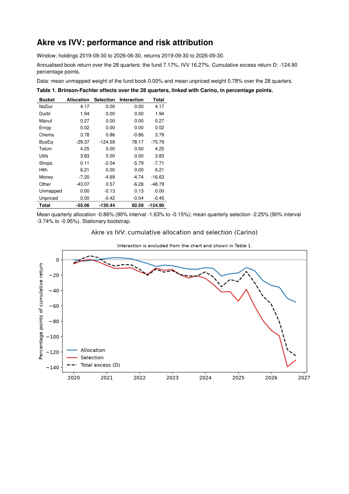
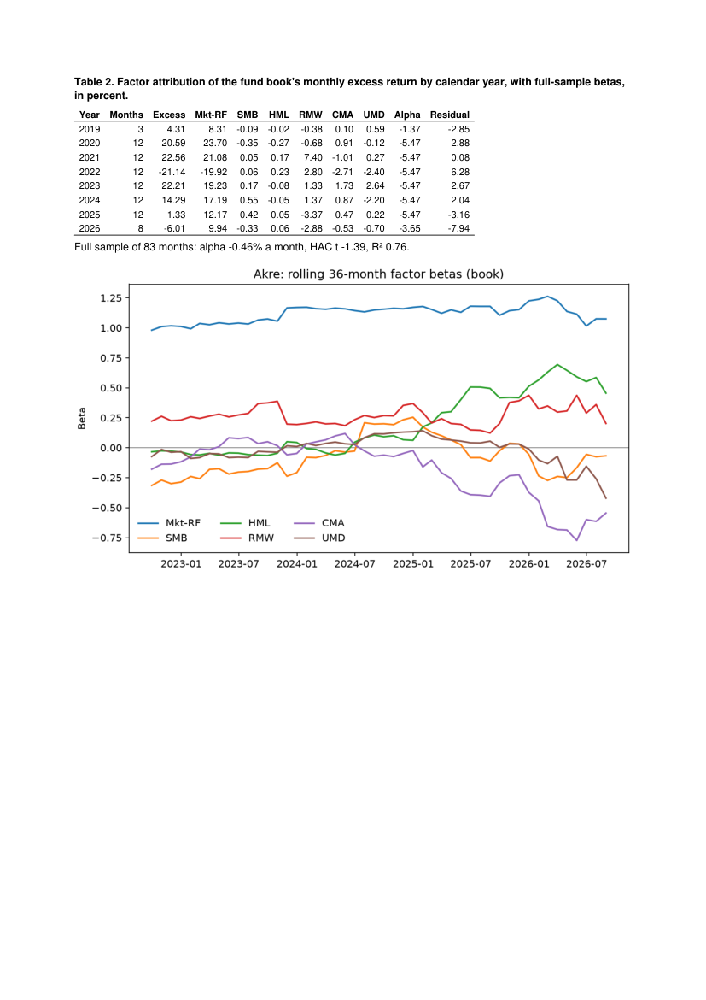
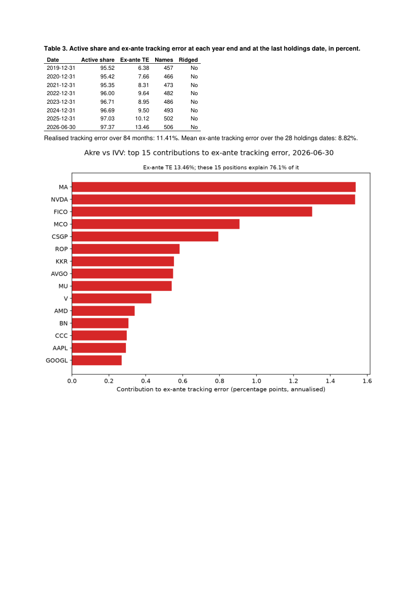
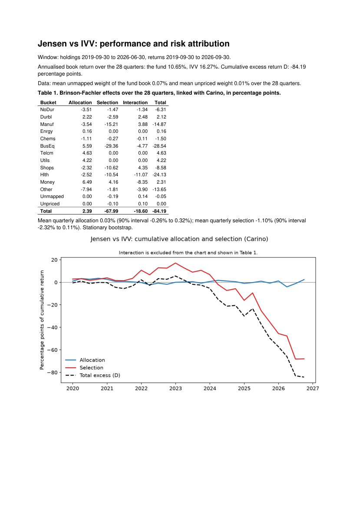
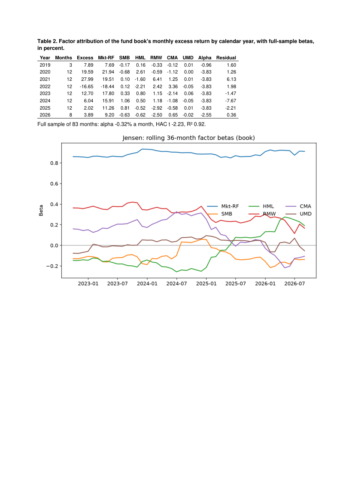
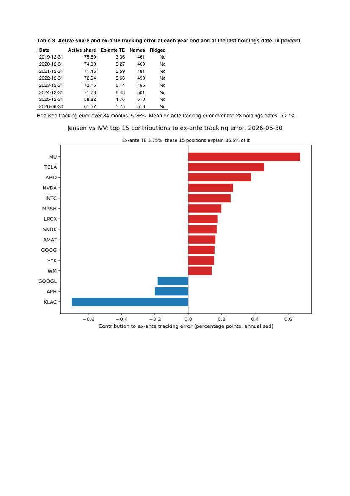
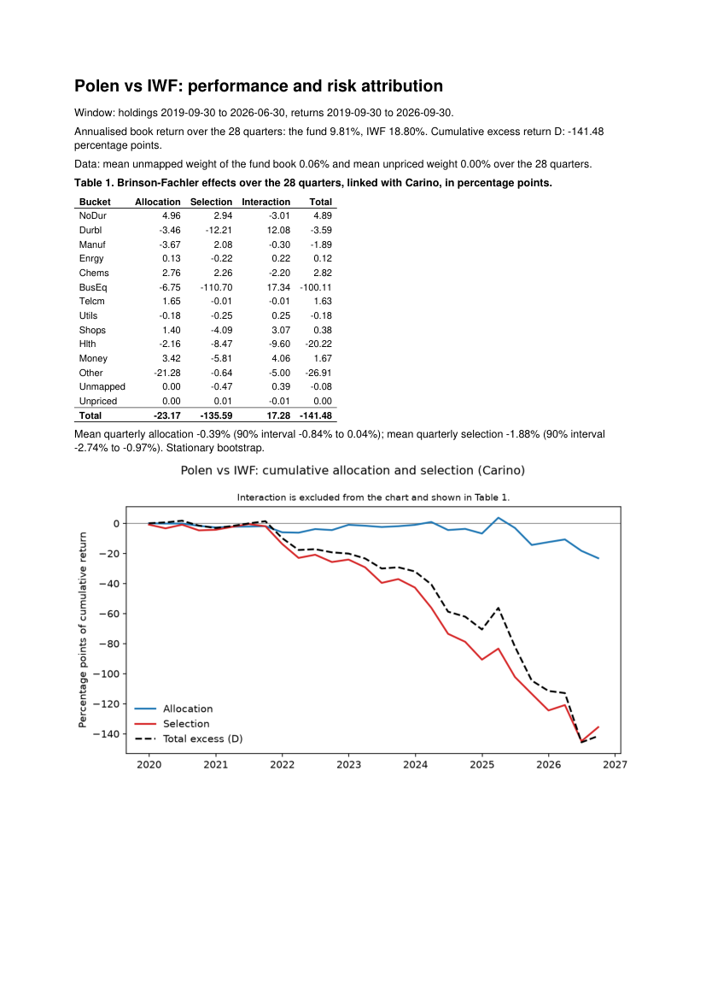
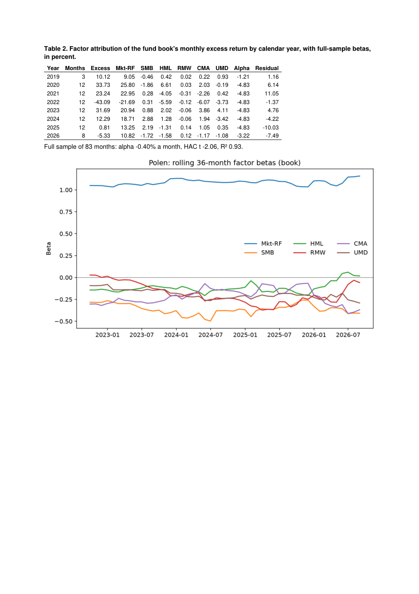
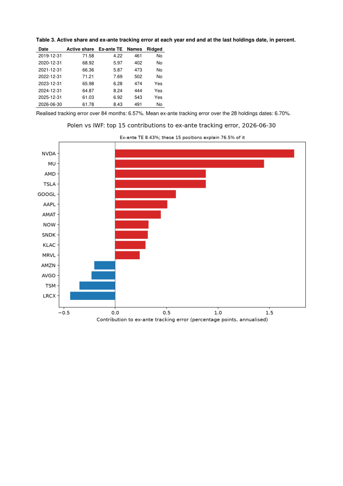
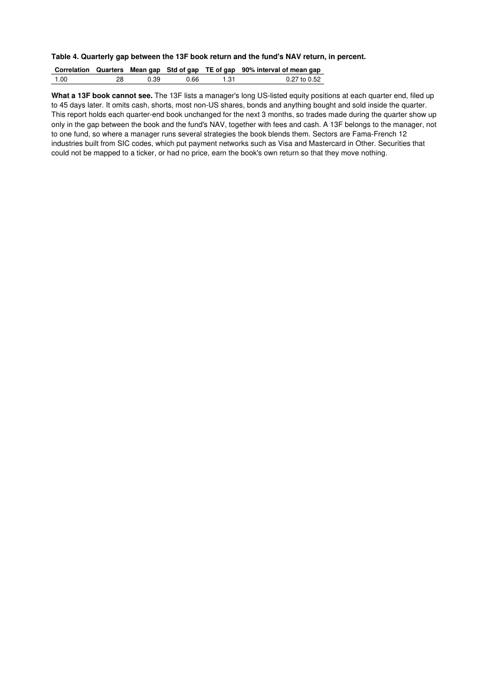

# Review — Section 7

## Section

Section 7, Report and entry point, run from `instructions/07_section_7.md`. Precedence (rule 13): that file over the `CLAUDE.md` amendments and `PLAN.md`, which beat the kickoff.

Outcome: **completed.** No rule 4 stop.

- Step 7.0 moved realised TE to all 84 book months. Akre's rises from 10.39% to 11.41%. Jensen's and Polen's move by 0.02 and 0.14 points (E.1).
- `build_report` writes the 4-page report of instructions/07 C.1. All 3 funds' reports have exactly 4 pages, checked with pypdf inside `run_all.py --section 7` (E.5).
- `attribute()` runs end to end on the committed mini data directory (E.2). On the real Akre and IVV books over the full window, it reproduces `linked.csv`, `risk_quarterly.csv`, `factor_by_year.csv`, `te_realised.csv`, `bootstrap.csv` and `book_quarterly.csv` to 2.2e-16 at worst (E.3). That check found 1 bug, fixed in `805b5ee`.
- The 7.3 pull mapped Teck (CUSIP 878742204 → TECK, CIK 886986) and wrote its prices to `data/extra/`. The files were then deleted (E.4).
- 2 runs of `run_all.py --section 7` gave byte-identical files: all 37 under `outputs/tables`, `outputs/figures` and `outputs/reports`, PDFs included.

## Steps completed

- 7.0 `realised_te` over every month of `book_monthly.csv`; `te_realised.csv` regenerated; `docs/CONVENTIONS_RESOLVED.md` item 25 (see Deviation 1) — `d8ba138`
- 7.1 `attrib/report.py`: `build_report`; `tests/test_report.py` (2 tests) — `6c6ed32`
- 7.2 `attrib/__init__.py`: `attribute`, `read_holdings`, `quarter_ends`, `load_security_map`, `load_prices_dir`; Charts 1 to 3 moved into `attrib/report.py` as `chart_1_png`, `chart_2_png` and `chart_3_png`, which `run_all.py` now calls; `tests/fixtures/mini/`; `tests/test_attribute.py` (2 tests) — `f6c6fa3`
- 7.3 `scripts/pull_data.py --holdings <path> --benchmark <path>` (`stage_holdings`) — `6cceebc`
- 7.4 `section_7` in `scripts/run_all.py`; `outputs/reports/{akre,jensen,polen}.pdf` — `9b21b5a`
- 7.2 fix: `attribute()` builds issuer keys from a text SECURITY_MAP, as `run_all` does — `805b5ee`

## Evidence

### E.1 Step 7.0: `te_realised.csv` before and after

Before is `73d799a`; after is `d8ba138`. Only `te_realised.csv` changed in `run_all.py --section 6`, and `git status` showed no other output.

```
old (83 months, 73d799a):
     fund  te_realised  te_exante_mean  n_months
0    akre     0.103945        0.088177        83
1  jensen     0.052394        0.052712        83
2   polen     0.064250        0.067050        83
new (84 months):
     fund  te_realised  te_exante_mean  n_months
0    akre     0.114092        0.088177        84
1  jensen     0.052607        0.052712        84
2   polen     0.065670        0.067050        84
     fund  te_realised_old  te_realised_new  change_pp  n_months_old  n_months_new
0    akre         0.103945         0.114092   1.014683            83            84
1  jensen         0.052394         0.052607   0.021274            83            84
2   polen         0.064250         0.065670   0.142009            83            84
```

### E.2 Tests for 7.1 and 7.2, including the mini end-to-end run

```
$ pytest -p socket --disable-socket -v tests/test_report.py tests/test_attribute.py
tests/test_report.py::test_two_builds_byte_identical PASSED              [ 25%]
tests/test_report.py::test_page_count_at_most_4 PASSED                   [ 50%]
tests/test_attribute.py::test_mini_end_to_end_offline PASSED             [ 75%]
tests/test_attribute.py::test_missing_cusip_error_lists_and_names_pull_command PASSED [100%]
======================= 4 passed, 3 warnings in 15.70s ========================
```

- `test_report.py` builds synthetic results shaped like a real fund: 28 quarters, 14 buckets, 8 years, 28 holdings dates, and charts at the real charts' sizes. `test_page_count_at_most_4` asserts both ≤ `report.max_pages` and exactly 4, with and without a NAV.
- The mini run is `attribute(holdings_fund.csv, holdings_benchmark.csv, "2019-12-31", "2020-03-31", data_dir=tests/fixtures/mini)`. It writes a 4-page PDF whose page 4 carries the no-NAV line.
- 2 of the 3 warnings come from the mini factor fit, which has 6 months for 7 parameters. See Open question 1.

The mini fixture was generated once with this script, run from the repo root. It is not committed. Draws, in order: daily returns `normal(0.0004, 0.015)` for 3 stocks over `bdate_range(2016-01-04, 2020-06-30)`; monthly factors `normal(0, 1) × [4, 2, 2, 1.5, 1.5, 3]` percent; RF `uniform(0, 0.2)` percent. All come from `default_rng(run.bootstrap_seed)`.

```python
cfg = load_config("config.toml")
rng = np.random.default_rng(cfg.run.bootstrap_seed)
days = pd.bdate_range("2016-01-04", "2020-06-30")
r = rng.normal(0.0004, 0.015, size=(len(days), 3)); px = 100 * np.cumprod(1 + r, axis=0)
months = pd.period_range("2016-01", "2020-06", freq="M")
f = np.round(rng.normal(0, 1, size=(len(months), 6)) * [4.0, 2.0, 2.0, 1.5, 1.5, 3.0], 2)
rf = np.round(rng.uniform(0, 0.2, size=len(months)), 2)
# MINA 3571 BusEq, MINB 2834 Hlth, MINC 6021 Money; CIKs 9000001 to 9000003
# fund 600/300/100 then 500/350/150 (thousand USD); benchmark 300/300/400 then 300/350/350
```

### E.3 `attribute()` on the real Akre and IVV books, against the `run_all` tables

The inputs are `_run` on `data/processed/holdings_akre.csv` and `holdings_ivv.csv`, from 2019-09-30 to 2026-06-30, with data dir `data`. The first attempt raised `TypeError: Invalid value '' for dtype 'Int64'` in `issuer_weights`. The cause: `run_all` reads `security_map.csv` as text, but `attribute()` held `cik` as `Int64`. `805b5ee` fixes this. After the fix:

```
_run: 21 s
linked: rows 30 vs 30, max |diff| 2.22e-16
risk_quarterly: rows 28 vs 28, max |diff| 2.22e-16
factor_by_year: rows 8 vs 8, max |diff| 9.71e-17
te_realised: rows 1 vs 1, max |diff| 5.55e-17
bootstrap: rows 3 vs 3, max |diff| 7.76e-17
book_quarterly: rows 56 vs 56, max |diff| 9.89e-17
```

### E.4 Step 7.3 run log, in full

Input `holdings_73.csv` has 2 rows: Akre's MA row at 2026-06-30 as in its book, and a Teck Class B row. The Teck value and shares were made up for the run. `--benchmark` is IVV's 2026-06-30 book, 503 rows, all already mapped.

```
entity,period_date,cusip,isin,sec_id,name,value_usd,shares
akre,2026-06-30,57636Q104,,57636Q104,MASTERCARD INCORPORATED,1022015722,1989906
akre,2026-06-30,878742204,,878742204,TECK RESOURCES LTD CL B,50000000,1000000
```

```
$ python scripts/pull_data.py --holdings h73.csv --benchmark b73.csv
$EA: possibly delisted; no price data found  (1d 2015-12-01 -> 2026-10-01)
$AVB: possibly delisted; no price data found  (1d 2015-12-01 -> 2026-10-01)
2 Failed downloads:
['EA', 'AVB']: possibly delisted; no price data found  (1d 2015-12-01 -> 2026-10-01)
504 sec_ids in the 2 files, 1 not in the data directory: ['878742204']
OpenFIGI results:
      sec_id id_type status result_rank          figi composite_figi ticker                      name exch_code market_sector security_type
0  878742204   cusip     ok           1  BBG000BSJTT0   BBG000BSJTT0   TECK  TECK RESOURCES LTD-CLS B        US        Equity  Common Stock
CIKs reached: [886986]; not in sic.csv, fetched from EDGAR: [886986]
      cik                name   sic                                         sic_description
0  886986  TECK RESOURCES LTD  1400  Mining & Quarrying of  Nonmetallic Minerals (No Fuels)
wrote data/extra/security_map_extra.csv:
      sec_id id_type ticker yf_ticker          figi                 figi_name     cik   sic   ff12 map_status    source
0  878742204   cusip   TECK      TECK  BBG000BSJTT0  TECK RESOURCES LTD-CLS B  886986  1400  Other     mapped  openfigi
yf_tickers with no price column: ['AVB', 'EA', 'TECK']
  no rows: AVB (no yfinance error recorded)
  no rows: EA (no yfinance error recorded)
wrote data/extra/adjclose_extra.parquet: (2723, 1), 2015-12-01 to 2026-09-30
                      TECK
first  2015-12-01 00:00:00
last   2026-09-30 00:00:00
n                     2723
```

- As expected: 1 new sec_id mapped (TECK), with its prices written to `data/extra/`.
- SIC 1400 is in no FF12 range, so Teck lands in Other (Convention 4.6).
- AVB and EA are IVV names already listed in `data/raw/prices/missing.csv`. The pull asked yfinance for them again and got nothing back. Nothing was written for them.
- Afterwards both files and `data/extra/` were deleted. Nothing under `data/extra/` is committed, and `data/raw/` and the manifest were not touched.

### E.5 The 3 PDFs: sizes and pypdf page counts

```
outputs/reports/akre.pdf 263867 bytes, 4 pages, sha256 4a1883a252959631
outputs/reports/jensen.pdf 253318 bytes, 4 pages, sha256 d62ace83b263bd33
outputs/reports/polen.pdf 249676 bytes, 4 pages, sha256 143ee932f2ddc98e
```

The fresh clone produced the same sizes, and its `git status` was clean after the run.

### E.6 Page renders (pymupdf, D-29, 100 dpi)

Files are in `review/section_7_pages/{fund}_p{n}.png`. They were rendered with `pymupdf.open(pdf)[i].get_pixmap(dpi=100).save(...)`.

Akre:






Jensen:






Polen:






## Tests run

```
$ .venv\Scripts\python.exe -m pytest -p socket --disable-socket -q
........................................................................ [ 90%]
........                                                                 [100%]
============================== warnings summary ===============================
.venv\Lib\site-packages\_pytest\config\__init__.py:864
  PytestAssertRewriteWarning: Module already imported so cannot be rewritten; socket
tests/test_attribute.py::test_mini_end_to_end_offline
  attrib\factors.py:53: SingularMatrixWarning: The design matrix is rank-deficient. The model parameters are not uniquely determined.
tests/test_attribute.py::test_mini_end_to_end_offline
  attrib\factors.py:62: RuntimeWarning: invalid value encountered in sqrt
80 passed, 3 warnings in 38.69s
```

## Fresh-clone check

The step commits were pushed to `805b5ee` first. The check ran on Windows at `C:\fc7`.

```
$ git clone https://github.com/uty101/Attribution-Engine-On-Real-Holdings.git /c/fc7
805b5ee step 7.2: attribute() keys issuers on a text SECURITY_MAP, as run_all does
$ uv venv --python 3.12
$ uv pip install -r requirements-lock.txt
$ uv pip install -e . --no-deps
$ pytest -p socket --disable-socket -q
........................................................................ [ 90%]
........                                                                 [100%]
============================== warnings summary ===============================
.venv\Lib\site-packages\_pytest\config\__init__.py:864
  C:\fc7\.venv\Lib\site-packages\_pytest\config\__init__.py:864: PytestAssertRewriteWarning: Module already imported so cannot be rewritten; socket
    self.import_plugin(arg, consider_entry_points=True)
tests/test_attribute.py::test_mini_end_to_end_offline
  C:\fc7\attrib\factors.py:53: SingularMatrixWarning: The design matrix is rank-deficient. The model parameters are not uniquely determined.
    fit = sm.OLS(y, sm.add_constant(X)).fit(cov_type="HAC", cov_kwds={"maxlags": maxlags})
tests/test_attribute.py::test_mini_end_to_end_offline
  C:\fc7\attrib\factors.py:62: RuntimeWarning: invalid value encountered in sqrt
    "resid_vol_ann": float(np.sqrt(np.sum(fit.resid.to_numpy() ** 2) / (n - k)) * np.sqrt(12)),
-- Docs: https://docs.pytest.org/en/stable/how-to/capture-warnings.html
80 passed, 3 warnings in 81.98s (0:01:21)
$ python scripts/run_all.py --section 7
section 1: all checks passed
section 2: all checks passed
section 3: all checks passed
section 4: all checks passed
section 5: all checks passed
section 6: all checks passed
outputs/reports/akre.pdf: 263867 bytes, 4 pages
outputs/reports/jensen.pdf: 253318 bytes, 4 pages
outputs/reports/polen.pdf: 249676 bytes, 4 pages
section 7: all checks passed
$ git status --short
(end of git status)
```

## Runtime per step

- 7.0: `run_all.py --section 6`, 92 s.
- 7.1: report tests, 15 s.
- 7.2: the mini end-to-end test, about 10 s. `_run` on the real Akre and IVV books, 21 s.
- 7.3: the pull, under 1 minute.
- 7.4: `run_all.py --section 7`, 148 s on the first run and 64 s on the second, with a warm disk cache.

## Deviations from PLAN.md

1. **Conventions item number.** Section A point 4 says "item 24". Item 24 was already taken by the step 6.0 residual volatility entry, so the cross-platform line is item 25, with a note saying so.
2. **Charts moved into `attrib/report.py`.** `attribute()` must render Charts 1 to 3 for a user's book, so the 3 renderers moved from `run_all.py` to `attrib/report.py` as `chart_*_png`. They now return PNG bytes via `matplotlib.figure.Figure`. `run_all.py` calls them and writes the bytes. The rerun of sections 1 to 6 left every PNG byte-identical, and `git status` was clean.
3. **The mini security map is in the raw layout.** C.3 says `attribute()` reads `data_dir/raw` and `data_dir/manual`. So the "3-row security map" is `raw/openfigi/mapping.csv` with 3 rows, plus `raw/sec/company_tickers.json`, `raw/sec/sic.csv`, a header-only `fallback.csv` and `manual/overrides.csv`, and a copy of `Siccodes12.txt`. `build_security_map` turns these into the 3 rows.
4. **Prices as CSV.** C.3 has the mini prices committed as CSV. `load_prices_dir` reads `raw/prices/adjclose.parquet` when it exists, else `raw/prices/adjclose.csv`.
5. **Calendar index.** `attribute()` takes q(h) from the price panel's index, not IVV's: a user data directory need not hold IVV. On the real data the 2 indexes are equal (2723 dates each, no difference).
6. **`coverage` for a user book.** It carries entity, period_date, n_rows_kept, unmapped_weight and unpriced_weight. The filing columns have no meaning for a user's file. The report reads only `period_date` from it.
7. **Report text choices.** The page 1 data line uses `book_quarterly.csv`, the weights of the 28 return quarters. Those equal `coverage.csv` over the same 28 dates: the means agree to the printed digits for all 5 entities. Annualised returns are (1 + R)^(4 / T) − 1 over T quarters. Correlation, HAC t and R² are plain numbers with 2 decimals; everything else is in percent. The gap interval is the last column of Table 4.
8. **`read_holdings` keeps a given `sec_id`.** A non-blank `sec_id` column is used as given. A blank or missing one follows amendment 8: the CUSIP when valid, else the ISIN.
9. **`attribute()` reads `config.toml` from the repo root** (`attrib/../config.toml`), as `attrib/edgar.py` already does. The signature has no config argument.

## Not verified

- The PDFs and PNGs across operating systems. Everything here ran on Windows; Section A point 4 already accepts byte differences there.
- `attribute()` with a data directory that has `extra/` files. `load_security_map` and `load_prices_dir` were exercised on the real data with no `extra/`. The 7.3 files were deleted before any `attribute()` run used them.

## Open questions

1. **The mini fixture cannot support the factor regression.** The window 2019-12-31 to 2020-03-31 gives 6 monthly book returns for 7 parameters. The full-sample fit is rank-deficient: its HAC t is about −2e15 and `resid_vol_ann` is NaN. Rolling betas have no complete 36-month window, so the mini Chart 2 is empty. The test passes, because it checks only that a PDF is written. Options: (a) leave it, since the mini run tests plumbing, not estimates; (b) extend the mini to more holdings dates, at least 3 more quarters for 15 months, so the fit has residual degrees of freedom.
2. **`attribute()` with a short window.** The same applies to any user window under 3 quarters. Options: (a) as now, report whatever the fit returns, with `n/a` for non-finite values; (b) skip Table 2 and Chart 2 below a minimum month count, and say so on page 2.
3. **The 7.3 pull retries known-missing tickers.** It asks yfinance again for every needed yf_ticker with no price column, including the 55 in `missing.csv`. Options: (a) keep it, since a later pull may find them; (b) skip tickers already in `missing.csv`.

## Files changed

```
attrib/__init__.py
attrib/report.py                                  (new)
docs/CONVENTIONS_RESOLVED.md
outputs/reports/akre.pdf                          (new)
outputs/reports/jensen.pdf                        (new)
outputs/reports/polen.pdf                         (new)
outputs/tables/te_realised.csv
scripts/pull_data.py
scripts/run_all.py
tests/test_report.py                              (new)
tests/test_attribute.py                           (new)
tests/fixtures/mini/                              (new, 11 files)
review/section_7.md                               (new)
review/section_7_pages/                           (new, 12 PNGs)
instructions/07_section_7.status.md               (new)
```

## Reviewer reads

1. `instructions/07_section_7.status.md`
2. E.1, E.3 and E.4 above
3. `review/section_7_pages/*_p1.png` to `*_p4.png`
4. `attrib/report.py`: `build_report` and `_page_1` to `_page_4`
5. `attrib/__init__.py`: `attribute` and `_run`
6. `scripts/run_all.py`: `realised_te`, `report_results`, `section_7`
7. `scripts/pull_data.py`: `stage_holdings`
